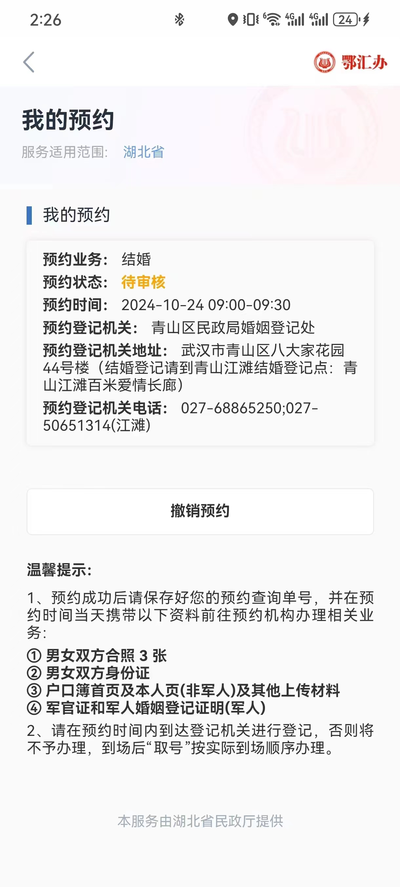
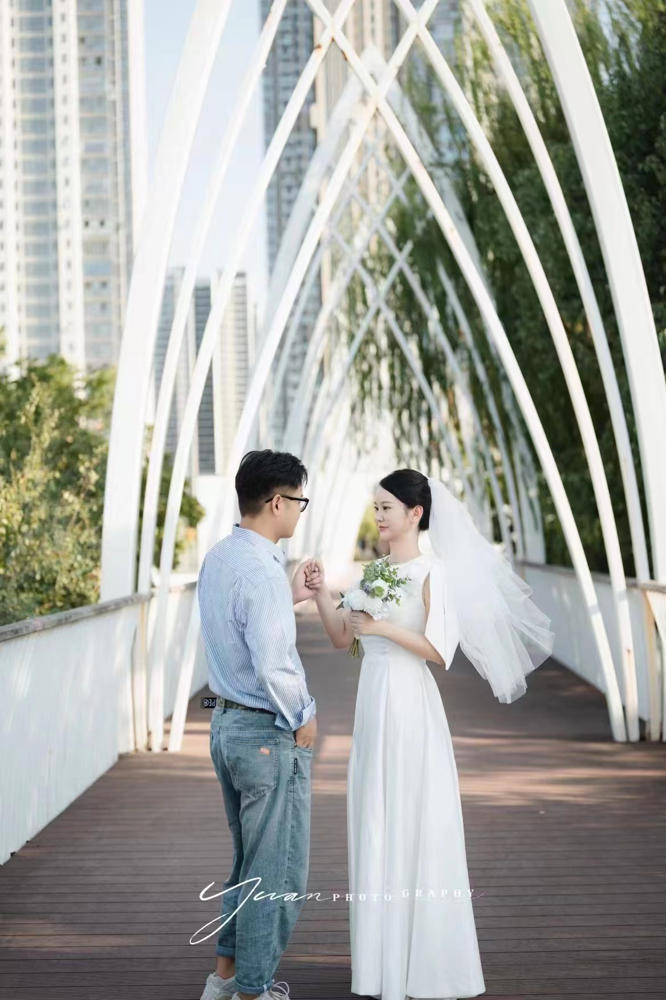
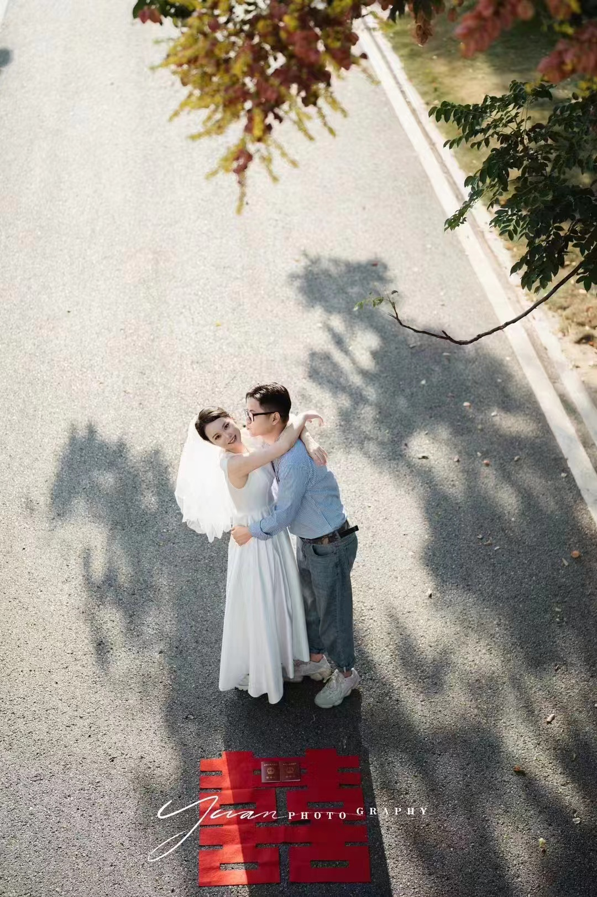
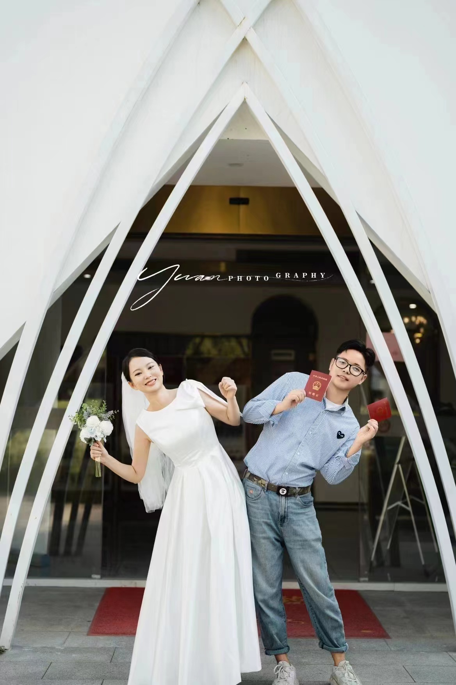

具体跟拍方案  
1. 前期准备  
1.1 设备准备 🎥  
相机： 主相机(佳能R50)  
镜头： 广角镜头（18-45mm），中长焦镜头（24-105mm）用于人像和中长焦拍摄，长焦镜头（70-210mm）远景拍摄  
存储卡： 16G(170MB/s)和128G(200MB/s)
电池： 原厂(1040mA) + 2 * (950mA) 
三脚架： 建议尽量使用稳定的地面或墙面作为支撑
外置闪光灯： 在逆光或阴影较多的情况下补光，让照片更加明亮和均匀  
1.2 场地勘查 🏛️  
提前去登记处了解环境，找到适合拍摄大场景和特写的地点和角度  
确认登记处的开放时间和流程，避免遗漏关键瞬间  
2. 跟拍当天流程  
2.1 出发前 🚗  
早到至少30分钟(路上车程两个小时,所以至少提前两个半小时,当天六点出发)，设置好设备，确保一切正常  
与新人沟通拍摄细节和重点，确认他们的需求和特别要求    
2.2 到达登记处 🌄    
8:30 - 9:00 捕捉新人到达的瞬间，记录他们的表情   
拍摄登记处外观大场景照片，以及新人进入登记处的照片（使用超广角镜头）   
9:00 - 9:30 办理过程   
拍摄新人填表、等待的过程，捕捉一些自然交流的瞬间    
拍摄新人交换誓言、领取结婚证的关键时刻（使用标准镜头和人像镜头 24-105mm走全程,如有特别的换长焦和广角）  
特写镜头记录细节，如填表、签署文件、誓言时的表情    
拍摄新人互动的细节，手部特写、交换戒指、亲密表情等  
2.3 办理流程中 📋  
拍摄新人交换誓言、领取结婚证的关键时刻  
使用广角镜头和超广角镜头，捕捉整个登记场景，确保有大场景镜头  
拍摄近景和特写，记录喜悦和感动的表情  
2.4 登记完成  
9:30 在登记处内外拍摄一些合影及单人照（超广角镜头用于背景大场景）  
捕捉新人走出登记处的喜悦瞬间，多角度拍摄（前后、左右）  
3. 登记后活动 🥂  
3.1 前往其他地点  
根据新人的安排，拍摄江滩等地的大场景和互动瞬间  
拍摄一些在其他美景下的新人照片，如公园或长廊（超广角镜头用于广阔背景）   
4. 后期处理 🎨  
4.1 选片  
从每个环节选出最佳照片，多角度展示整个过程   
注重挑选有纪念意义的照片，特别是大场景照片  
4.2 修图  
调整色彩平衡、曝光和对比度  
特别关注大场景照片的构图和效果   
4.3 制作相册   
与新人确认相册设计，搭配简单的文字描述或日期  
可以制作电子相册或实体相册，根据新人的需求    
5. 交付 🎁   
提前与新人约定交付方式和时间  
提供电子版和精修的照片   
提供备份方案，如云端存储，方便新人随时查看    

具体的信息细节:  
   

新人希望的拍摄机位(重点):  

