# 深度学习
深度学习的核心来自神经网络(可以看做一门语言),它是一个非常灵活的框架(组合神经元来表达问题的先验知识).

--2024/04/13

#### **跳转**  
[数据](#数据) [线性代数](#线性代数) [矩阵计算](#矩阵计算) [自动求导](#自动求导) [线性回归+基础优化算法](#线性回归基础优化算法) [Softmax回归+损失函数+图片分类数据集](#softmax回归损失函数图片分类数据集)  [模型选择+过拟合and欠拟合](#模型选择过拟合and欠拟合)  [权重衰退](#权重衰退)  [丢弃法](#丢弃法)  [数值稳定性+模型初始化和激活函数](#数值稳定性模型初始化和激活函数)   
[待学链接](#这里是待学链接) 

  

#### 机器学习/深度学习 的应用  
* 图片分类  
* 物体检测(*人在什么地方*)和分割(*每一个像素属于飞机还是人*)  
* 样式迁移  
* 人脸合成  
* 文字生成图片  
* 文字生成(*GPT*)  
* 无人驾驶
>案例研究：广告点击  
特征提取（*广告主；产品描述；产品图片*） => 模型（训练数据【过去广告展现和用户点击】 -> 特征和用户点击 -> 模型） => 点击率预测

### 环境安装
> 前置conda  

```
conda env remove d2l-zh  
conda create -n d2l-zh python==3.8
conda activate d2l-zh  
pip install d2l torch torchvision  
```
[d2l资源包下载点击此处](https://zh-v2.d2l.ai/d2l-zh.zip) 


## 数据
#### n维度数组是机器学习和神经网络的主要数据结构  

> 0-d(标量)(一个类别)   
> 1-d(向量)(一个特征向量)  
> 2-d(矩阵)(一个样本-特征矩阵)(行是样本,列是特征)  
> 3-d **RGB图片** (宽x高x通道)  
> 4-d **一个RGB图片的批量** (批量大小x宽x高x通道)  
> 5-d **视频批量** (批量大小x时间x宽x高x通道)

创建数组需要三个东西 : **形状 + 数据类型 + 元素值**

**[这里是代码预览](../DeepLearning-Code/Preview/data.md)**   
###### [这里是数据代码下载](../Code/data.ipynb)  

标准的算术运算(+ - * / **)都是按元素运算的

张量(tensor)就是多维数组

**广播机制** : 用于维度不同的两个张量执行元素操作,具体是shape中数字向上变化.  
> eg. a.shape = (3, 1) b.shape = (1, 2)  
> trans to a.shape = (3, 2) b.shape = (3, 2)  
> [0] &emsp;  [0] [0]  &emsp;&emsp;[2, 3] &emsp; [2] [3]  
> [1] to [1] [1]  &emsp; &emsp;&emsp;&emsp; to [2] [3]  
> [2] &emsp; [2] [2]  &emsp;&emsp; &emsp; &emsp;&emsp; [2] [3]

执行原地操作:
```
# 创建一个shape与Y相同,元素全为0的张量Z
Z = torch.zeros_like(Y)
Z[:] = X + Y
# 执行完之后,Z的id与会与Z之前保持一致,原因是没有找一个新的变量来保存结果(没有重新分配内存),只是改变了Z中的值.
# 如果不需要保存x的值,则可以直接在x所处内存中直接改写值:
X += Y
# 这样也不会改变X的id,也是原地操作
```
Numpy的ndarray可以转换为torch的Tensor
```
A = X.numpy()
B = torch.tensor(A)
type(A), type(B)
=>(numpy.ndarray, torch.Tensor)
```

## 线性代数

矩阵可以把向量扭曲,**方向不会被矩阵改变的向量是特征向量**  


> 标量的shpe是空的

**[这里是代码预览](../DeepLearning-Code/Preview/Linear-algebra.md)**  

## 矩阵计算

> 主要问题是看矩阵怎么求导数(模型的优化求解都是通过求导数进行的)


> ∂y/∂**x** 是行向量,∂**y**/∂x 是列向量 (x,y本身就是列向量), ∂**y**/∂**x** 是一个矩阵


## 自动求导


**[这里是代码预览](../DeepLearning-Code/Preview/Automatic-guide.md)** 

## 线性回归+基础优化算法

**线性模型可以看做是单层的神经网络**  

平方损失:&emsp;
$$\iota(y,\hat{y}) = \frac{1}{2}(y-\hat{y})^2$$

线性回归是对n维输入的加权,外加偏差.  
使用平方损失来衡量预测值和真实值的差异.  
线性回归有显式解.  
线性回归可以看做是单层神经网络.  

> 一个优化方法是小批量梯度下降  

梯度下降通过不断沿着反梯度方向更新参数求解.  
小批量随机梯度下降是深度学习默认的求解算法.  
两个重要的超参数是批量大小和学习率.  


后一项是:学习率 x 损失函数关于$w_{t-1}$ 的梯度

#### 一个完整的模型
> **数据读取，模型定义，参数初始化，损失函数，训练模块**

**[!!!这里是代码预览](../DeepLearning-Code/Preview/Linear-regression.md)**  

## Softmax回归+损失函数+图片分类数据集

回归的特点:  
单连续数值输出  
自然区间R  
跟真实值的区别作为损失  

分类的特点:   
通常多个输出  
输出i是预测为第i类的置信度  

回归==多类的分类问题;分类的类别编码可以是one-hot

softmax可以这么理解:  

$$
\hat{y}=softmax(o)
$$  

$$
\hat{y_i}=\frac{exp(o_i)}{\Sigma_k exp(o_k)}
$$  

这两个东西可以做区别,也就是这俩是一个东西.下面是对类别$o_i$做指数之后得到的一个整数概率.上面是真实的对o作用softmax之后的概率,上面的o是一个one-hot的向量.  
**softmax让每个类的置信度是一个概率.**

而衡量两个概率间的差别用交叉熵来做.
$$
H(p,q) = \underset{i}{\Sigma}-p_i log(q_i)
$$  
对于分类问题:
$$
l(y,\hat{y})=-\underset{i}{\Sigma}y_i log\hat{y_i}
$$
,由于$y_i$是one-hot的,所以公式 
$$
l(y,\hat{y})=-log\hat{y_y}
$$

损失函数用于衡量预测值和真实值之间的区别.

一般,读数据的时间要比训练时间要快很多才可以.

**[这里是代码预览](../DeepLearning-Code/Preview/Image-classification.md)**  

## 多层感知机

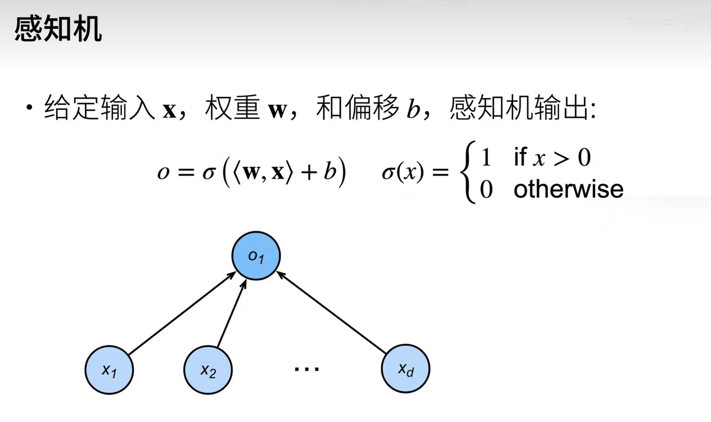

看图可知,多个输入,单个输出,可以做二分类问题.  
> 感知机等价于使用批量大小为1的梯度下降,并使用这个损失函数:    

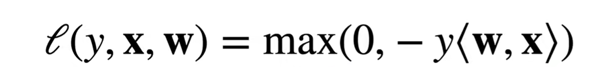

> 多层感知机:一个感知机画一条线,两个画两条线,这样就可以做分类了,学习XOR问题.  

> 一个简单函数做不了,就再加一个,做不了就再加一个.

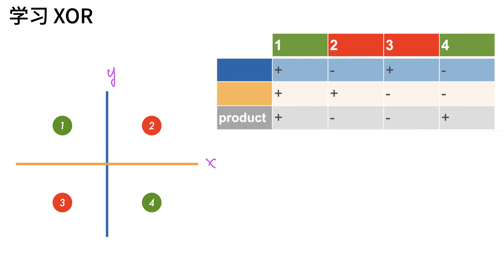  

> 它有隐藏层,隐藏层的大小是一个超参数,反映在图上就是右边的那个表格,W1是m x n的.

#### 总结  
* 多层感知机使用隐藏层和激活函数来得到非线性模型.  
* 常用的激活函数是Sigmoid,Tanh,ReLU[常用].(用激活函数的意思是,不搞成线性的了,跟线性模型作区分)  
* 使用softmax来处理多分类.  
* 超参数为隐藏层数,和各个隐藏层大小.  

**[这里是代码预览](../DeepLearning-Code/Preview/MLP.md)**  

## 模型选择+过拟合and欠拟合  
> 训练误差:模型在训练数据上的误差.  
> 泛化误差(关心的是这个):模型在新数据上的误差.  

验证数据集:一般拿50%的训练数据做验证数据集,而且拿出来的不用做训练数据集.  
测试数据集:只能被使用一次.  

k折交叉验证:1...k 使用第i块作为验证数据集,其余作为训练数据集.  
报告K个验证集误差的平均.  
通常K取5或10  
  

线性分类器的VC维(深度学习很少用):N维输入的感知机的VC维是N+1  

## 权重衰退

通过限制参数值的选择范围来控制模型容量
>||a||^2 <= θ

在更新的时候每一次对权重做一次放小,这是一个权重的衰退过程

## 丢弃法

好的模型需要对输入数据的扰动鲁棒  
丢弃法会对每个元素做扰动,但是会让噪音的期望与原始值不变,意思是无偏差加入噪音   
>通常用在MLP的中间层,作用在隐藏全连接层的输出上,把某一些概率小于p的值变成0

## 数值稳定性+模型初始化和激活函数

计算梯度时,会使用到很多乘法,让小的值变小,让大的值变大,这个时候就会发生对应的梯度消失或者爆炸的问题  
>resnet让时序过长的部分乘法变成加分  
>或者梯度归一化

选取合理的权重初始值和激活函数可以提升数值稳定性  

>>non是梯度爆炸的问题,解决办法可以是降低学习率


## PyTorch神经网络基础

net = nn.Sequential(nn.Linear(20, 256), nn.ReLU(), nn.Linear(256, 10))  
**nn.Sequential定义了一种特殊的Module**

```
class MLP(nn.Module):
    def __init__(self):
        super.__init__()
        self.hidden = nn.Linear(20, 256)
        self.out = nn.Linear(256, 10)

    def forward(self, X):
        return self.out(F.relu(self.hidden(X)))
使用: 
net = MLP()
net(X)  
```
**所有的神经网络的层或者模块都应该是Module的子类,这上面是自定义块,它继承了Module的所有init,自定义了hidden和out,同时定义了向前传播函数.** 输入是20,输出是10  


>定义自己的Sequential
```
class MySequential(nn.Module):
    def __init__(self, *args):
        super.__init__()
        for block in args:
            self._modules[block] = block
    
    def forward(self, X):
        for block in self._modules.values():
            X = block(X)
        return X

使用:
net = MySequential(nn.Linear(20, 256), nn.Relu(), nn.Linear(256, 10))  
net(X)
```
**用*args传递多个变量,即多个层**

混合搭配各种组合块的方法

net.weight.data可以看到net中某一层的值

```
torch.save(net.state_dict(), 'mlp.params')
```
把mlp所有的参数存成一个字典,是名称到值的映射

## 卷积

**卷积是一个特殊的全连接层**  

在模式匹配里,它具有平移不变形和局部性的特点.  

>前者体现在**二维**~~卷积~~**交叉相关**  
>后者体现在|a|,|b| > Δ, Va,b = 0  

* 卷积层将输入和和矩阵进行交叉相关,加上偏移后得到输出
* 核矩阵和偏移是可学习的参数  
* 核矩阵的大小是超参数

**它避免了一个因为输入变大而输出变大的问题**

卷积的填充避免了尺度丢失,步幅能够倍数地减少计算量

## 卷积层的多输入多输出通道

* 每个通道都有一个卷积核,结果是所有通道卷积结果的和  
* 可以有多个三维卷积核,每个核生成一个输出通道 

> 每个输出通道对应一个特定的模式

## 池化层

**因为卷积的位置敏感性强,需要池化来保证一定程度的平移不变性**
> 深度学习中的步幅与池化窗口的大小相同

## LeNet  

**这个东西最早做手写数字识别**

**LeNet的核心代码**
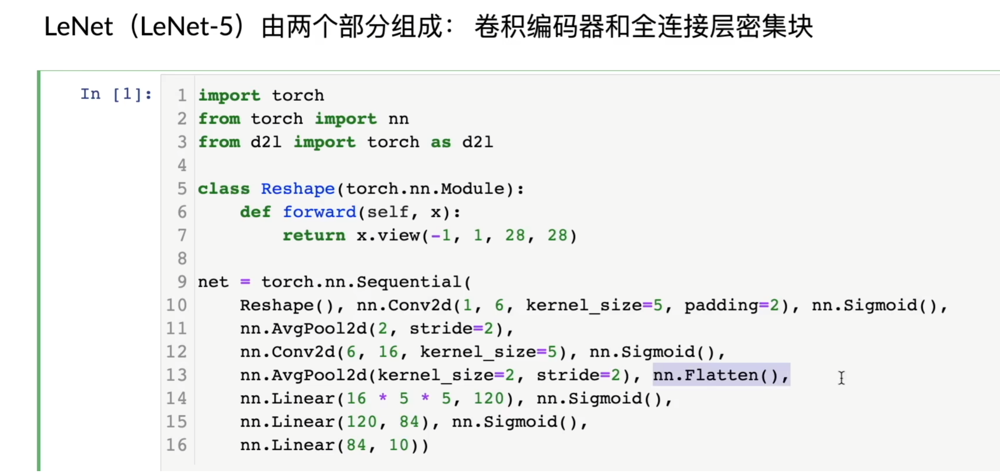

## AlexNet

**它是更大的LeNet,10x参数个数,260x计算复杂度,引入丢弃法,ReLU,最大池化层,数据增强,它赢得2012ImageNet竞赛后,标志着新一轮的神经网络热潮的开始**  

**AlexNet的核心代码,不同的是他最后有dropout丢弃层,把一半的值置为0,另一半乘以2.** 
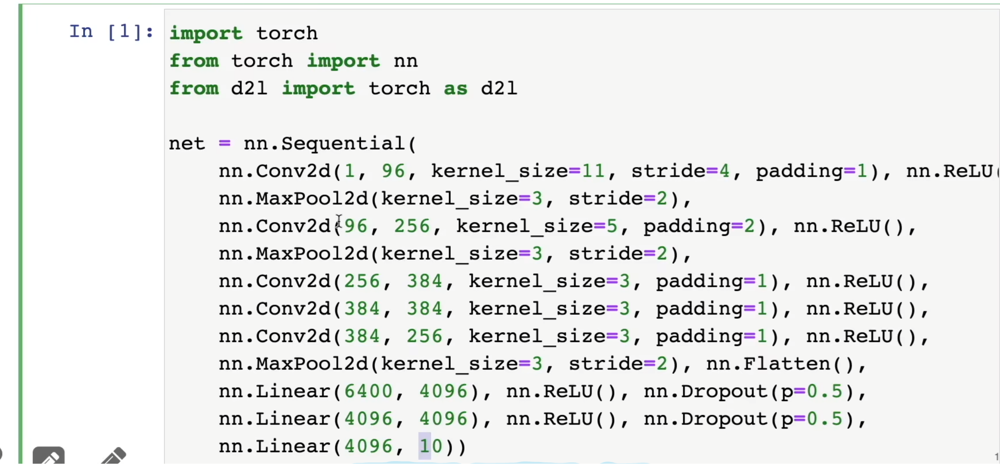

**如果前面的卷积抽取的特征不够深,那么后面的两个大全连接层是非常重要的.**

## 使用块的网络VGG
**它是AlexNet的拓展,就是把一些卷积,一个池化做成一个单位,多单位累计的过程.**  
**它是更大更深的AlexNet.**  
**他需要定义一个vgg块,包含卷积的层数,输入通道数量,输出通道数量**  
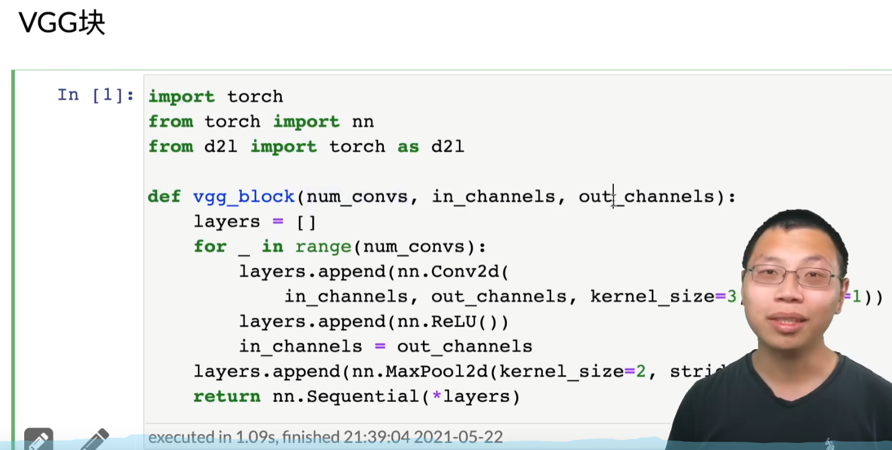
**然后再来定义整个vgg网络**  
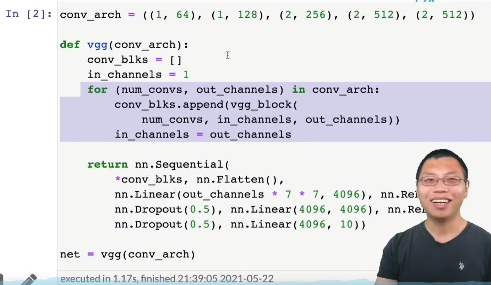

## NiN(Network in Network)
网络中的网络  

**NiN块:在一个卷积层后面跟两个全连接层,步幅是1,核大小是1x1,起到全连接层的作用**  
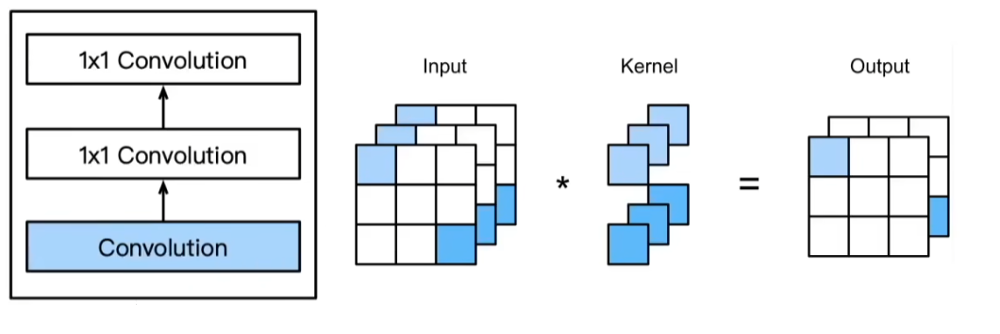
**NiN架构最后用了一个全局平均池化层来替代VGG核AlexNet的全连接层**  

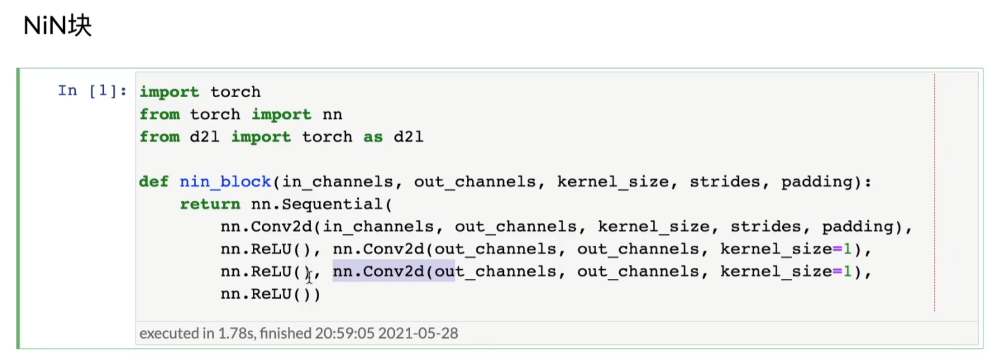
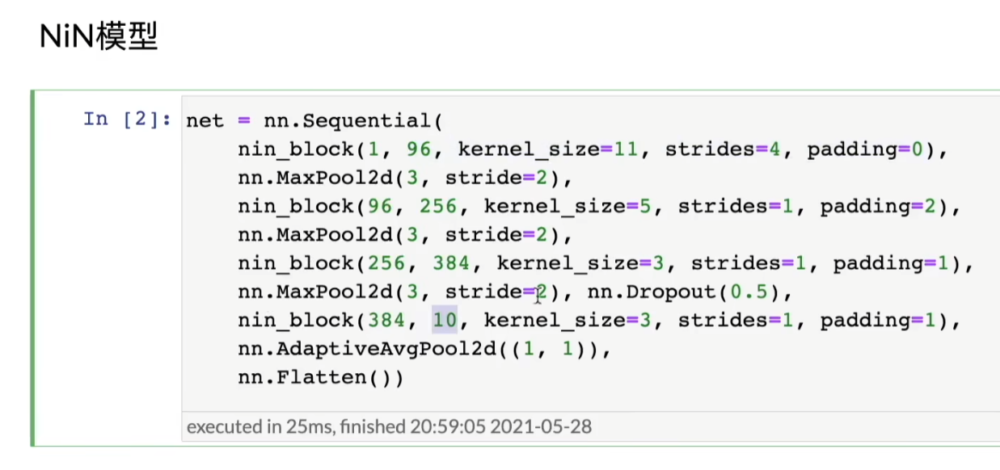

## GoogLeNet  
**里面有超过100个卷积层**  
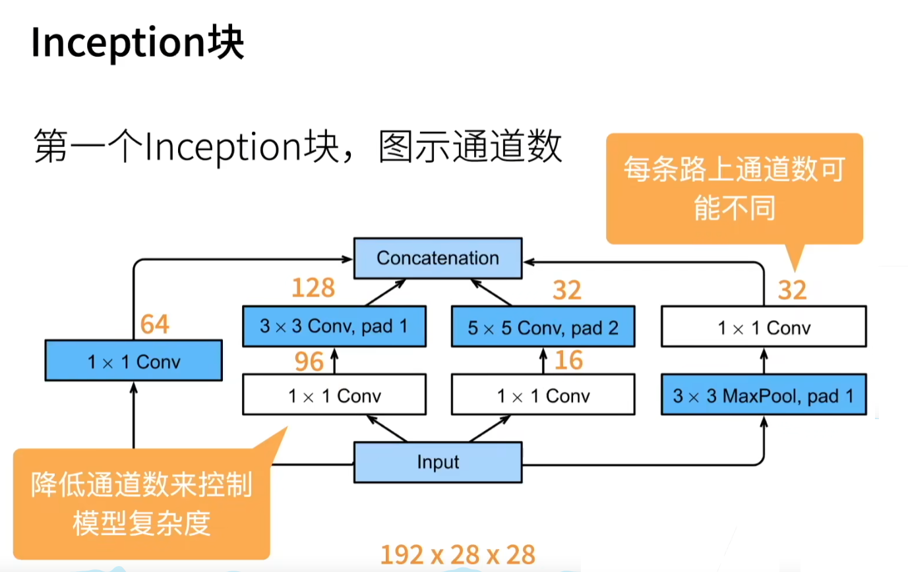
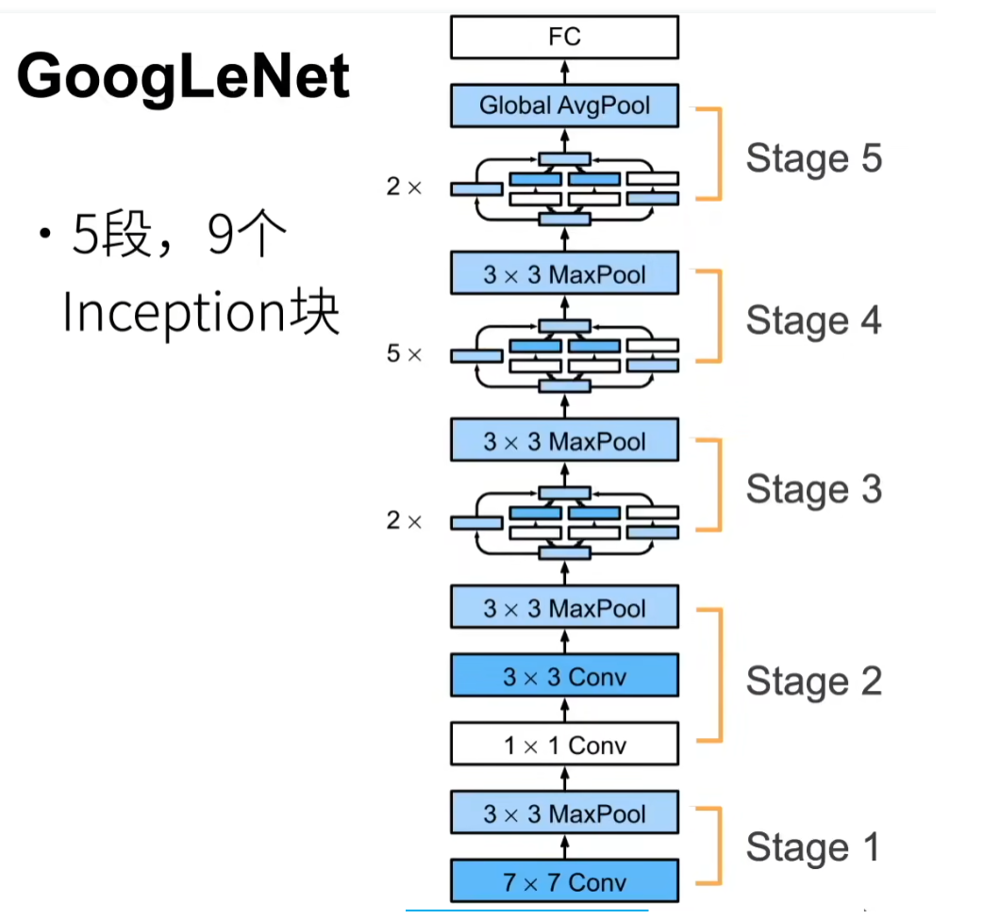

## 批量归一化  
**在做深的层的时候,需要这个.**  

为了避免在学习底部层的时候变化顶部层.  

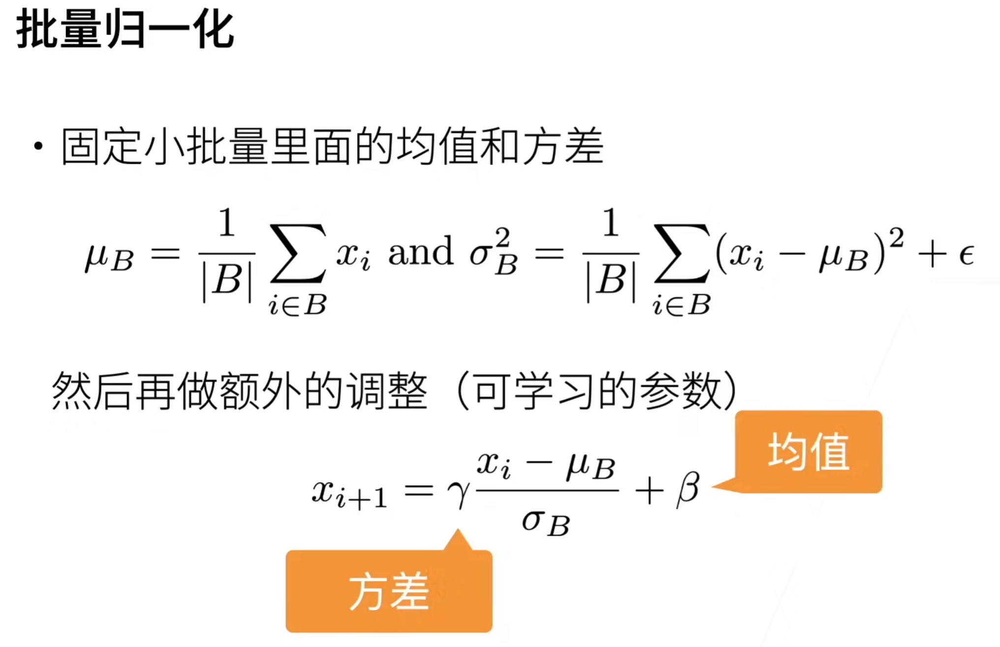  
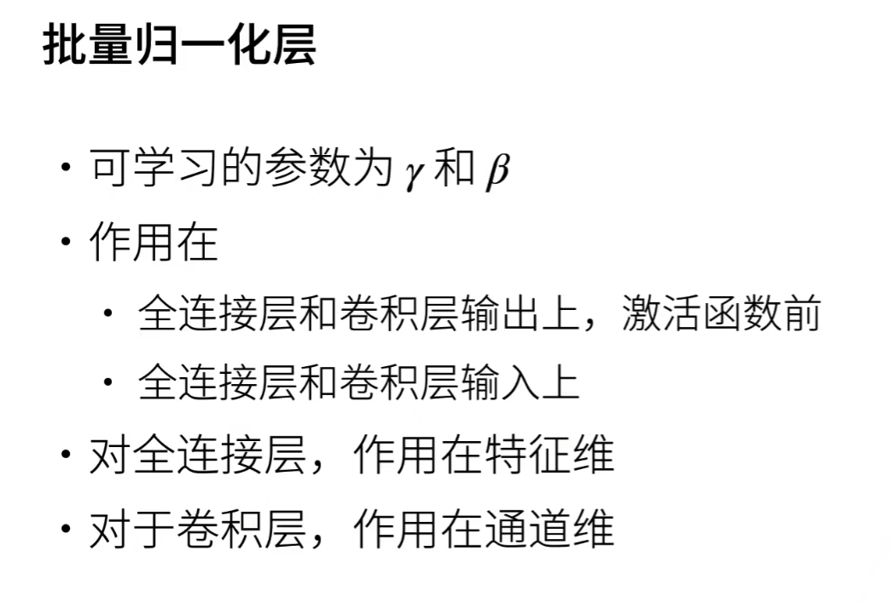

**最初用这个东西是想用它来减少内部协变量转移,但是后续有论文指出它可能就是通过在每个小批量里加入噪音来控制模型复杂度.没必要把这个跟DropOut混合使用.**  
**使用这个可以使用更大的学习率.**  
**先卷积,再BatchNorm,再激活,再池化.**

## ResNet
**如果在卷积神经网路里只能看一个网络,那就看ResNet.**

串联一个层改变并扩大函数类,得到一个f(x) = x + g(x)的结构.  

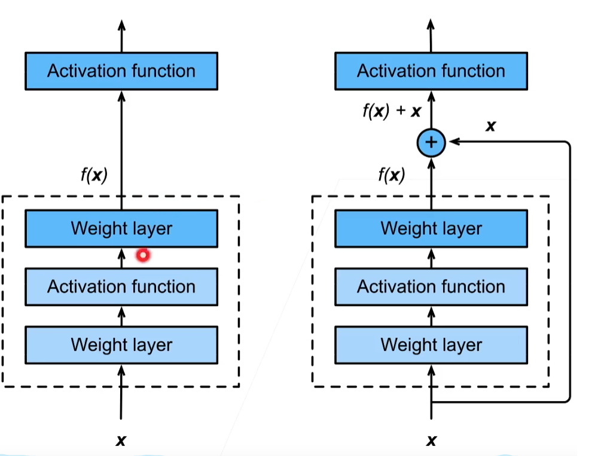

ResNet块,可以是高宽减半,通道加倍的resnet块,或者是多个高宽不变的resnet块,在高宽减半就很好理解,就是直接在残差获取点之后的卷积里进行3x3的卷积,残差跳跃过程中不做操作;通道加倍就是在跳跃连接中加入一个1x1的卷积,做通道增益.    
残差获取可以是卷积,激活,批量归一化之前,插入点可以是批量归一化,卷积,激活之后,位置很灵活.  

**ResNet架构**  
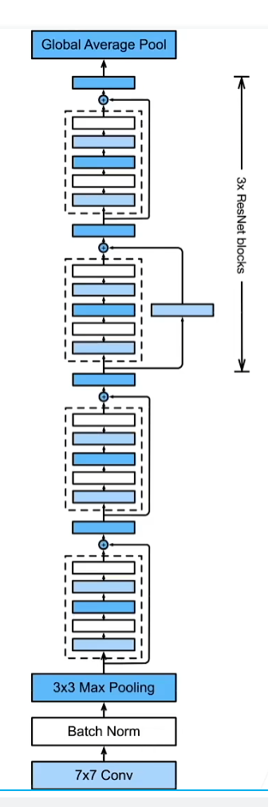 

从导数的角度来看也是这样,resnet可以把层做的很深,因为y = f(x) + g(f(x)),这个y是下一层卷积的输出,而且残差是加法原则,一个大数加一个小数结果是一个大数,而在传统的卷积中,使用的乘法原则,在内部看它的导数的时候,一个大数乘一个小数结果可能是一个小数,这导致在接近数据端梯度过小,可能会学不到东西.  


## CPU和GPU

提升GPU利用率:  

并行,使用数千个线程,比如,合并两个数组,直接用c = a +  b,而不是写一个循环,利用下标来合并.  
内存本地性,因为GPU的缓存做得很小,大部分面积给了计算.  
少用控制语句,因为如果碰到if,所有的核or线程就会暂停,所以同步开销会很大.  

不要频繁在CPU和GPU之间传数据,由于带宽限制的存在,也会给两者带来同步开销.  

单机多卡并行:  
数据并行->把整个数据分为多个数据块,每个GPU拿一个数据块,拿回参数,计算梯度,发出梯度,更新梯度.  
模型并行->把模型拆成几个部分,每个GPU拿一个部分模型,比如GPU0拿前50层,GPU2拿后50层.  
  
**batchsize变大,训练的有效性是会变小的,因为在训练中,制定了多少batchsize达到一个accuracy,batchsize增多意思是说我要用更多的样本来达到一个同样的accuracy,这解释了为什么有效性会变小,而且,有一个对应关系是,batchsize变大,lr需要变小.  

## 数据增广  

增加一个已有数据集,使得有更多的多样性:改变图片的颜色和形状.  

只作用在训练的时候,算是一个正则项,而且在线生成.  

做水平翻转:垂直翻转通常是不可行的,比如猫.  

切割:从图片中按照随机高宽比3/4 4/3,随机大小8% 100%, 随机位置来切割一块,然后变形到固定形状.  

改变色调,饱和度,明亮度的0.5 1.5.  

## 微调

把在大数据集上做的特征提取的部分用到自己的数据集上.  

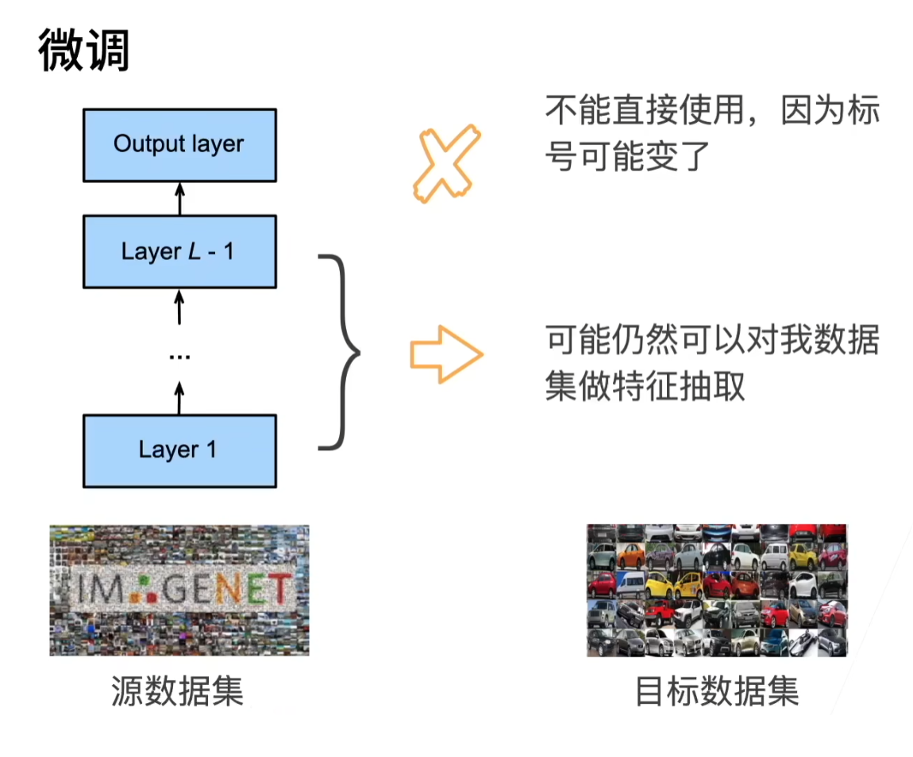

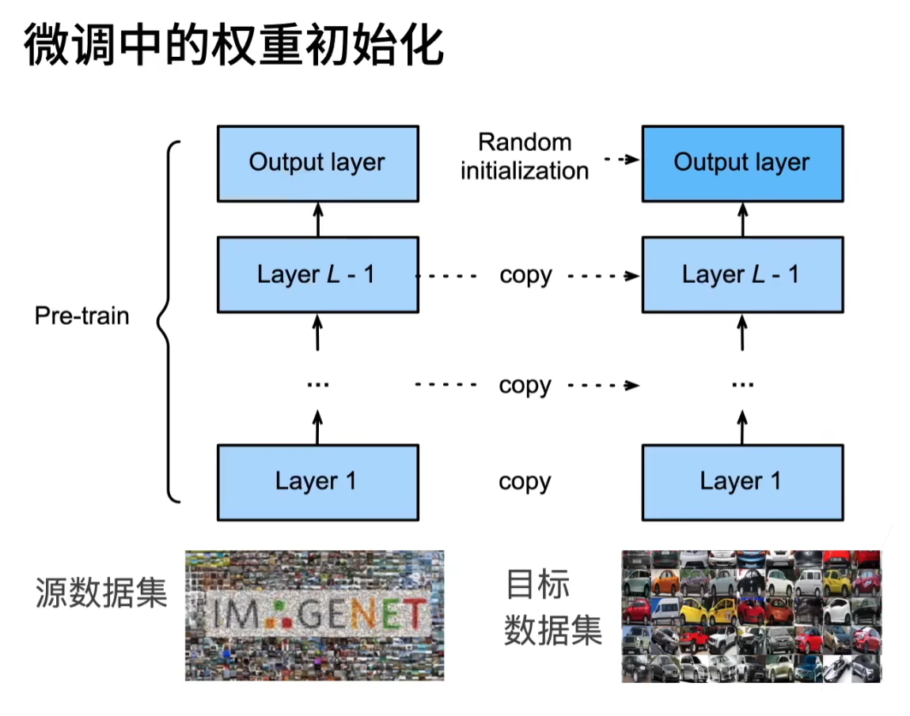

**微调通过使用在大模型上得到的预训练好的模型来初始化模型权重来完成提升精度(可以看成是一个正则).**    
**预训练模型的质量非常重要.**   
**微调通常速度更快,精度更高.**  

越底层,越通用,因为它们是在做纹理的提取.  


---
## [这里是待学链接](https://www.bilibili.com/video/BV1NK4y1P7Tu/?spm_id_from=autoNext&vd_source=5a8651962259df7b14781b1d0370c6a0)