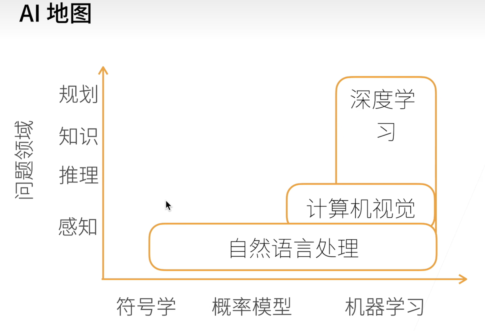
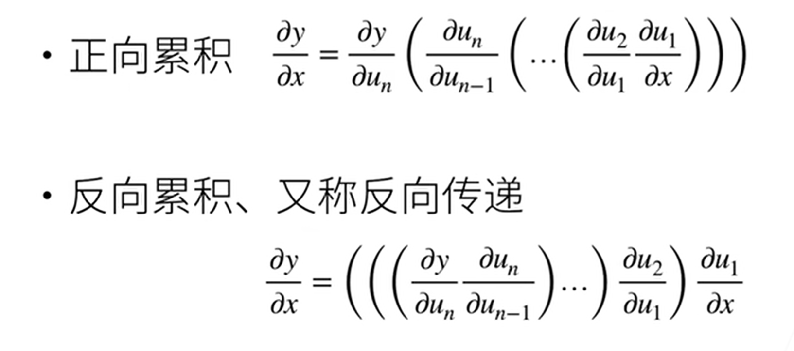

# 深度学习
深度学习的核心来自神经网络(可以看做一门语言),它是一个非常灵活的框架(组合神经元来表达问题的先验知识).   

#### **跳转**  
[数据](#数据) [线性代数](#线性代数) [矩阵计算](#矩阵计算) [自动求导](#自动求导) [线性回归+基础优化算法](#线性回归基础优化算法) [Softmax回归+损失函数+图片分类数据集](#softmax回归损失函数图片分类数据集)   
[待学链接](#这里是待学链接)

  

#### 机器学习/深度学习 的应用  
* 图片分类  
* 物体检测(*人在什么地方*)和分割(*每一个像素属于飞机还是人*)  
* 样式迁移  
* 人脸合成  
* 文字生成图片  
* 文字生成(*GPT*)  
* 无人驾驶
>案例研究：广告点击  
特征提取（*广告主；产品描述；产品图片*） => 模型（训练数据【过去广告展现和用户点击】 -> 特征和用户点击 -> 模型） => 点击率预测

### 环境安装
> 前置conda  

```
conda env remove d2l-zh  
conda create -n d2l-zh python==3.8
conda activate d2l-zh  
pip install d2l torch torchvision  
```
[d2l资源包下载点击此处](https://zh-v2.d2l.ai/d2l-zh.zip) 


## 数据
#### n维度数组是机器学习和神经网络的主要数据结构  

> 0-d(标量)(一个类别)   
> 1-d(向量)(一个特征向量)  
> 2-d(矩阵)(一个样本-特征矩阵)(行是样本,列是特征)  
> 3-d **RGB图片** (宽x高x通道)  
> 4-d **一个RGB图片的批量** (批量大小x宽x高x通道)  
> 5-d **视频批量** (批量大小x时间x宽x高x通道)

创建数组需要三个东西 : **形状 + 数据类型 + 元素值**

**[这里是代码预览](../Code/Preview/data.md)**   
###### [这里是数据代码下载](../Code/data.ipynb)  

标准的算术运算(+ - * / **)都是按元素运算的

张量(tensor)就是多维数组

**广播机制** : 用于维度不同的两个张量执行元素操作,具体是shape中数字向上变化.  
> eg. a.shape = (3, 1) b.shape = (1, 2)  
> trans to a.shape = (3, 2) b.shape = (3, 2)  
> [0] &emsp;  [0] [0]  &emsp;&emsp;[2, 3] &emsp; [2] [3]  
> [1] to [1] [1]  &emsp; &emsp;&emsp;&emsp; to [2] [3]  
> [2] &emsp; [2] [2]  &emsp;&emsp; &emsp; &emsp;&emsp; [2] [3]

执行原地操作:
```
# 创建一个shape与Y相同,元素全为0的张量Z
Z = torch.zeros_like(Y)
Z[:] = X + Y
# 执行完之后,Z的id与会与Z之前保持一致,原因是没有找一个新的变量来保存结果(没有重新分配内存),只是改变了Z中的值.
# 如果不需要保存x的值,则可以直接在x所处内存中直接改写值:
X += Y
# 这样也不会改变X的id,也是原地操作
```
Numpy的ndarray可以转换为torch的Tensor
```
A = X.numpy()
B = torch.tensor(A)
type(A), type(B)
=>(numpy.ndarray, torch.Tensor)
```

## 线性代数

矩阵可以把向量扭曲,**方向不会被矩阵改变的向量是特征向量**  


> 标量的shpe是空的

**[这里是代码预览](../Code/Preview/Linear-algebra.md)**  

## 矩阵计算

> 主要问题是看矩阵怎么求导数(模型的优化求解都是通过求导数进行的)


> ∂y/∂**x** 是行向量,∂**y**/∂x 是列向量 (x,y本身就是列向量), ∂**y**/∂**x** 是一个矩阵


## 自动求导



**[这里是代码预览](../Code/Preview/Automatic-guide.md)** 

## 线性回归+基础优化算法

**线性模型可以看做是单层的神经网络**  

平方损失:&emsp;
**$
\iota(y,\hat{y}) = \frac{1}{2}(y-\hat{y})^2
$**

线性回归是对n维输入的加权,外加偏差.  
使用平方损失来衡量预测值和真实值的差异.  
线性回归有显式解.  
线性回归可以看做是单层神经网络.  

> 一个优化方法是小批量梯度下降  

梯度下降通过不断沿着反梯度方向更新参数求解.  
小批量随机梯度下降是深度学习默认的求解算法.  
两个重要的超参数是批量大小和学习率.  


后一项是:学习率 x 损失函数关于$w_{t-1}$ 的梯度

#### 一个完整的模型
> **数据读取，模型定义，参数初始化，损失函数，训练模块**

**[!!!这里是代码预览](../Code/Preview/Linear-regression.md)**  

## Softmax回归+损失函数+图片分类数据集

回归的特点:  
单连续数值输出  
自然区间R  
跟真实值的区别作为损失  

分类的特点:   
通常多个输出  
输出i是预测为第i类的置信度  

回归==多类的分类问题;分类的类别编码可以是one-hot

softmax可以这么理解:  

**$\hat{y}=softmax(o)$**  

**$\hat{y_i}=\frac{exp(o_i)}{\Sigma_k exp(o_k)}$**  

这两个东西可以做区别,也就是这俩是一个东西.下面是对类别$o_i$做指数之后得到的一个整数概率.上面是真实的对o作用softmax之后的概率,上面的o是一个one-hot的向量.  
**softmax让每个类的置信度是一个概率.**

而衡量两个概率间的差别用交叉熵来做.**$H(p,q) = \underset{i}{\Sigma}-p_i log(q_i)$**  
对于分类问题:**$l(y,\hat{y})=-\underset{i}{\Sigma}y_i log\hat{y_i}$**,由于$y_i$是one-hot的,所以公式 **$l(y,\hat{y})=-log\hat{y_y}$**

损失函数用于衡量预测值和真实值之间的区别.

一般,读数据的时间要比训练时间要快很多才可以.

---
## [这里是待学链接](https://www.bilibili.com/video/BV1K64y1Q7wu/?spm_id_from=333.999.0.0&vd_source=5a8651962259df7b14781b1d0370c6a0)