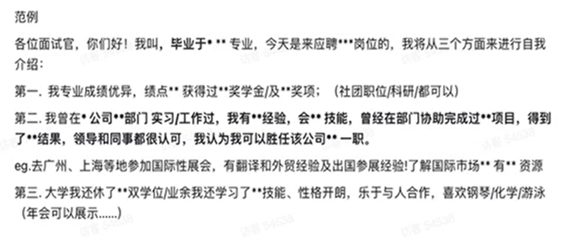
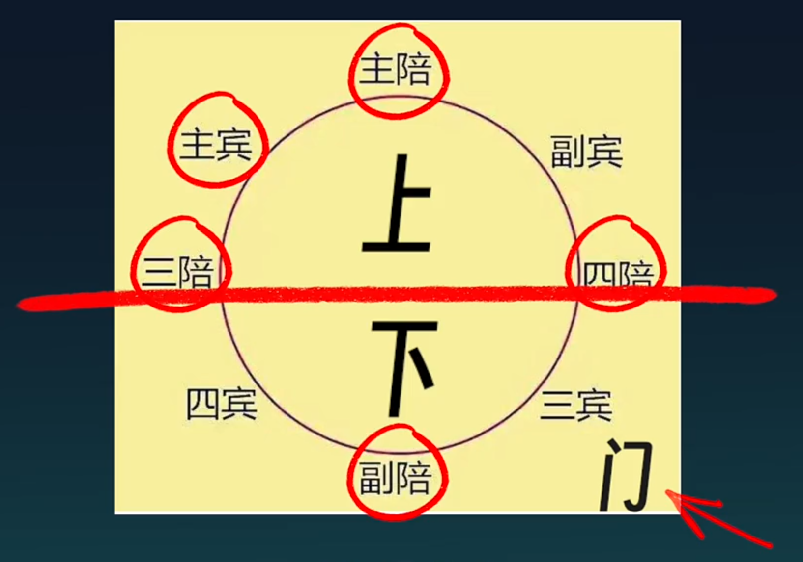

## 草帽未来的内容

**四大板块:**  
### [赛道](#赛道选择)  
### [副业](#副业选择)  
### [实习](#实习选择)  
### [职场能力](#职场能力培养)  

[AI工具](#ai工具)  [海南封关](#海南封关)  [延迟退休和退休计划](#延迟退休)
### 一个原则:这些东西不是用来学的,是用来做的.  

## 赛道选择  

### 风口预测的底层逻辑  

"一个人的成功,在于他进入了一个上升的行业,在上升的行业中,你不需要太聪明,也不需要太勤奋,行业会拖着你走" -- 查理·芒格

三个圈定律:  
1. **宏观政策**.(跟着国家政策走)   
2. **市场**.(市场经济是看不见的手,具体来说是钱往哪个方向走)   
3. **个人**.(个人能力模型,知识储备,个人兴趣爱好)  

中心点是**风险**.风险是1,其他是0,风险把控至关重要.  

具体来说:  
1. **看市场规模**,选市场规模更大的赛道.  
2. **看市场集中度**,不建议市场规模集中的行业,例如电商行业市场集中度极高.  
3. **看行业增速**,避免增速为负的行业,**比对国家GDP增速和行业增速**.  
4. **看利润**,查看公司财报,公司都不赚钱,就业肯定会更困难.  

挑完行业挑公司,看企业.  
  
  
  
  
存量时代:没有造不出的产品,只有卖不出的产品.  

分工的利润分布在生产端和销售端,**技术人才就夯实基础**,销售人才就多走出去,运输端管控风险,但更接近利益分配端,会更容易利己.  

所有的数据来源可以看行业报告,**例如[证监会](http://www.csrc.gov.cn/)**.  
BAT数据平台:  
[阿里研究院](http://www.aliresearch.com/cn/index)

### 好赛道 
1. 含咖啡因饮料.  
2. 美妆.  
3. 博彩.  
4. 二手/平替.  
5. 旅游.  
6. 殡葬.  
7. 生殖辅助.  
8. 私密护理.  
9. 冷链物流.  
10. 新能源:**风光车储氢核**.   

### 城市选择

1. 按GDP选择城市(**总量和增量**).   
2. 按产业和专业推荐.  
3. 小本生意的产业集群.   

直接看报告  
```
搜索关键词:  
1. 年份+省份+产业增速.  
2. 年份+省份+产业集群.  
3. 年份+省份+GDP增速快的原因.  
```

直接看人口聚集

```
长三角城市群.  
珠三角城市群.  
京津冀.  
成渝都市圈.  
西部中心城.  
```

### 可能高薪酬的行业

一个点:如何成为一个产品经理:有研发思维,做虚拟产品的研发和服务,懂得管理,用产品化的思维来做产品然后来做销售.  

### 人才认证

查看人才计划  
1. 搜公众号.  
2. 官网: **某某市 + 人社局**  
3. 微信: **城市名称 + 人才认定/人才认证/人才评级**

查看各地区的人才评级,ABCDE类人才的要求是什么,比如E类人才需要在专项技能上获得名次.  

在当前文凭通胀的情况下,获取专项技能或许比获取研究生毕业证重要.  

也要顺应周期,行业的发展周期规律的存在会出现一个现象,IT行业不如传统技能行业的薪酬.  

### 新生儿下降  

一个家庭的最大支出,房子,车子,孩子(四脚吞金兽).  
婴儿代表的是消费力(先)再是劳动力(后). 

1. 对政府的影响:  
影响劳动供应和人口增长从而影响经济增长和就业市场.  
养老金现收现发,交的人少了,发的人多了,财政迟早会入不敷出,对社会保障和养老金系统造成压力(往高新科技转型,推迟退休时间).  

2. 教师行业:  
2024是在校学生的拐点.  
教育者市场正在逐渐缩水.  

3. 老年人赛道:  
银发经济是香饽饽.  
老年大学的本质是社交(心灵上和情绪价值的慰藉是付费成功的关键).  

4. 母婴赛道:  
做高端产品.  
医护人员尽量避免妇产相关岗位.  
儿童消费品需求减少.  

5. 房地产行业:  
未来学区房和房地产会逐渐脱钩.  
娱乐,医疗设施附近的房地产升值空间较大.  

6. 男性消费:
中年男人有三宝:钓鱼,茅台,始祖鸟.  

### 银发经济

用全球的眼光看中国,用产业的眼光看行业,用行业的角度挑公司.  

1. 家政服务行业(认知症照护;相关医疗设备,筛查,陪护等;陪诊师).  
2. 老年消费年轻化.  
3. 养生(专属保健;慢性病;保健食品;康复器具).  
4. 宠物和房地产.

### 跨境电商

前置内容:**直播课2024中央经济工作会议 + 跨境电商大佬的谈话**  

跨境电商有万亿级别的市场规模,对比着看游戏有三千亿,电影2023有600亿.  

1. 外贸是To B的业务:公司对公司;偏线下,交易双方商谈后签订合同,走海关;大宗货物,交易金额大,流程繁琐.  
2. 跨境是To C的业务:公司对用户;线上为主,依赖电商平台交易;更注重运输时间和效率.  

### 自媒体  

前置内容:**从0到1自媒体怎么做 + 如何找对标账号**

财富的机会:从前->公司+渠道 --> 现在->平台+个体.  

1. 腾讯:视频号爆发;2023年整体营收翻倍;30岁以上人群.  
2. 抖音:越接近生活越有流量;游戏,娱乐主播赛道.   
3. 小红书:营销人群,营销生活状态;着手买手经济(女性用品,情绪,玄学,家教).  
4. bilibili:#顺大势逆小势,2023持续亏损;平台核心是变现;目标群体是大学生,年轻用户.  
5. 快手:接地气,做下沉市场;家庭教育赛道;旅游赛道.  

对标账号:明确诉求,找到相似的达人,复制成功模式.  

避雷:不靠谱的课程,养号;流量充值(只能让爆的更爆,不能让一个没有内容的变爆)的目的是定向地增加产品曝光性;陪跑.   

选题:视频爆不爆,选题占80%;学会拆解爆款.  

### 产能过剩的行业

供大于求就是产能过剩  

后果:裁员;公司倒闭;资本不敢投资.

1. 钢铁.  
2. 房地产:玻璃,水泥,多晶硅,煤炭,化工.  
3. 服装行业:衣服库存卖不出去;中古款,定制,小众是未来发展趋势.   
4. 白酒,电器.  
5. 新能源:锂电池价格下跌;汽车行业.  
6. 光伏和储能.  
7. 轮胎.  
8. 猪肉.  
9. 学校,酒店.  


### 商业陷阱  

1. 为什么越努力越没钱:  
目前:崇尚生产者->崇尚消费者   
```
所有的初衷是消费驱动的(**从消费者思维转变成生产者思维**).    
身材好,长相更明艳带来的通常是危险,经济好的时候更喜欢冒险,所以经济好的时候的大众审美会更趋向于明艳的女星.反之经济不好更趋向于小家碧玉一点. 
```

2. 洗护行业:  
更改产品包装,形态,提高复购率,变得更小包装.    

3. 宣传行业:  
黑公关:广东灵车事件.  

从商业的角度,从营销的角度,从顺大势逆小势的角度做一个聪明的生产者,而不是愚昧的消费者.  

---
---

## 副业选择 

### 副业赛道  
前置内容: **3-3 副业选择, 3-4 财商法则, 3-5 商业思维 + 报喜鸟**  

**一个核心,要探索上下游**.

1. 情趣用品.  
2. 国货美妆/生殖辅助/假发/成人教育.
3. 教育相关:志愿辅助填报.  
4. 手工类型:手工美甲/宠物帽子/书法/手机壳.  
5. 娱乐类赛道:短剧分销/益智玩具/演唱会经济/电商模特.  
6. 玄学:转运手链.  
7. 咸鱼.  
8. 社交类:圈子KOL(key option leader).
9. 代理类.  

---
---

## 实习选择


---
---

## 职场能力培养

### 35岁危机

落户,各种补贴以及深造,买房,公司的优待都要求35岁以下的人群.  
催婚有35岁的心理线,催育有35岁的警戒线,各类医学研究都把35岁最为高龄产妇的分界线.  


1. 技术/职能岗转管理:做好本职工作,再有能力去带团队掌握更多权利,往公司利益链上走(拿股权和分红).  
2. 和直属上级搞好关系:不要越级汇报,但要越级社交.  
3. 培养**市场营销能力**:培养自己直接跟市场交易的能力,从公司跳出来做自己的工作室(**看沟通的课**).    
4. 挖掘有价值的资产:著作权,专利权,IP创作,手艺人.  
5. 存钱的同时学投资.  
6. 利用杠杆:资本,劳动力,自媒体,软件.  

### 跳槽转行

招聘流程:


1. 选好赛道.  
2. 积累行业人脉:细致询问行业从业者什么样的人比较适合这个行业;公域求助;关注行业公众号;直接去面试,获取信息;找圈子.  
3. 反向训练:利用信息茧房,关注你想了解的行业,主动刷,让算法推荐;低成本试错,避免三分钟热度.    
4. 一个重要原则:换行不换岗,换岗不换行.  

离职前的准备:
1. 事以密成,语以泄败.  
2. 离职时间(15号以后),入职时间(15号之前),否则会影响公积金.  
3. 离职申请书(通知书).    
4. 提前薅羊毛,在职期间有稳定的工资流,可以把签证,信用卡提前办好.   
5. 清理私人文件和工作交接证明.  

离职前的证明:
1. 离职证明:盖公司的公章,标注之前的职位,写明离职日期.  
2. 收入证明.  
3. 结束劳动合同证明(被辞退可以领失业保险).  

### 离职操作 

四个维度:**事,人,钱,个人能力**.  

1. 事:行业;公司;能力和工作是否匹配.  
2. 人:领导,同事和下属(职场是一面四处透风的墙);  
3. 钱:工资不到位;  
4. 能力:好公司能学到很多东西;重复低价值的劳动浪费时间.  

不要随便离职:  

1. 不自信导致焦虑辞职.  
2. 情绪性的突发辞职.  
3. 工作犯错辞职逃避.  
4. 领导骂人就辞职.  


### 反PUA  

煤气灯效应:指对受害者施加的情感虐待和操控,让受害者逐渐丧失自尊,产生自我怀疑,无法逃脱.  

1. 不明确工作目标,通过不断否定进行精神打压.  
2. 营造岗位竞争焦虑,美化压榨行为.  
3. 画大饼从未实现,大锅每个都给你背.  
4. 营造自身人设,对你实施情绪绑架.  
5. 施加超负荷工作任务.  
6. 挑拨关系,边缘化员工.  

面对捧杀怎么办:  
1. 捧:给领导捧回去.  
2. 停:离开指派任务的空间.  
3. 吐:把钩子吐他脸上.  

面对贬杀怎么办:  
1. 捧:感谢领导的关心.  
2. 反问:详细的询问细节.  


### 职场屠龙(好领导和坏领导)  

企业的竞争是人才的竞争.   

怎样判断好领导:  
1. 好领导的定义是波动的.  
```
1. 自我管理技能:管理的第一步是自我管理.   
2. 人际关系技能:给予下属充分的信任;批评不点名表扬很具体.  
3. 是否会图吞功劳.  
```

怎样判断坏领导:  
1. 只评判不指导:只会说对和不对;只讲方向,不讲落地细节;只看结果,不看努力过程.   
2. 喜欢矛盾管理法:喜欢背后嚼舌根.  
3. 笑面虎领导:爱抽象的人不爱具体的人.  

如何处理和坏领导的关系:  
1. 风险隔离:保留证据,在工作群留痕.  
2. 明确职责:工作内容尽量行程书面文案;工作内容以文案发送工作群.  
3. 暗度陈仓:长远规划自己的发展,提升职场的生存能力;骑驴找马,前置准备跳槽.   

### 认识自己  

关键问题是自己的兴趣点在哪里:**把生活兴趣转移到职业兴趣**.  

关注:  
1. 时间流水(时间都花在哪里了):注意力在哪里.    
2. 金钱流水(钱都花在哪里了):养活了谁,看流向也能养活自己.  

这两点做交集.  

三个圈:   
1. 兴趣圈.  
2. 能力圈.  
3. 职业圈.  

根据各个圈的特性在自己身上或者招聘网站上找元素,然后取交集.  

[MBTI性格测试](https://www.16personalities.com/ch/):挖潜能.  
[霍兰德兴趣测试](https://www.arealme.com/holland-code-career-test/cn/#:~:text=%E9%9C%8D%E5%85%B0%E5%BE%B7%E8%81%8C%E4%B8%9A%E5%80%BE%E5%90%91%E6%B5%8B%E8%AF%95.)

### 从背景提升到五险一金  

背景提升和简历包装:  
1. 参与项目写广为人知的作为第一带头者.  
2. 更加的广地参与项目.    
3. 拿更多的title.  
4. 实习,合作,专业储备,社团经历.   
5. 不招最好的,只招最合适的.  
6. 语言优化用STAR法则:Situation,Tatget,Action,Result.  
7. 达到某某同等水平.   

面试仪表:  
1. 首因效应:人跟人的社会属性决定了前一分钟的重要性.   
2. 穿着干净,职业装,商务休闲,低饱和度,黑白灰.   
3. 签到礼仪:多带笔,敲门礼仪,微鞠躬.  
4. 使用书面或专业的语言.   
5. ending礼仪:感谢各位面试官,谢谢你们的时间.   

网申:
1. 信息是关键:学校就业的老师是第一信息来源.  
2. 临校的招聘信息.  
3. 招聘软件.   

自我介绍:  
1. 一分钟的自我介绍,围绕与工作的契合来做,180-220字.  
2. 不背稿,不重复简历,没自信是大忌.   
3. 15s:姓名,教育经历.
4. 30s:工作经历(STAR).     
5. 15s:其他的个人性格特点.   


线上面试:   
1. 摄像头清晰.  
2. 眼神交流.  
3. 个人形象,充分表达自己的求职意愿,背景环境.  
4. 成功四要素:让面试官记住你;以一个好的印象记住你;面试官觉得你适合岗位;面试官觉得有潜力.  
5. 展示表达能力;展示管理能力;展示团队合作能力;展示学习能力.  

群面:
1. 就是真实的工作场景的展现.  
2. 角色分类:Leader;**记录员**;TimeKeeper.   
3. 不能一言不发,不能不团结.  
4. 要有团队意识,有责任性,体现专业性.  
5. **峰终定律**.    

终面: 
1. 大boss:手上的offer两个,说明为什么还要来面的原因.  
2. 不展现优秀,展现合适,展现潜力(专业,通用).  
3. 潜力,价值观比较合适.   
4. 业务部分的发展规划可以作为提问.  
5. 薪资看行业平均值,加个人能力的10-20的上浮.   

合同:
1. offer是录用通知.  
2. 三方协议是正是签约形式.  
3. 劳动合同是正是雇佣协议.   
4. offer可以多拿,三方只能签一个.  

步入职场:  
1. 小公司做事,大公司做人.  
2. 第一个月:多观察,少出头;看清楚组织架构.  
3. 人,技能,目标,工作.  
4. 归零意识.  
5. 禁忌:八卦!越级汇报!做事留痕!不要光提问题!  

向上管理:  
1. 管理老板的预期,管理老板的沟通方式.   
2. 打破视察:转变成你俩都有共同目的,敢于交流.   
3. 了解上级:摆正观念,接纳且为我所用;**了解性格**.  
4. **汇报原则**:先约时间:xx领导,我针对于某某项目可能需要花您多少时间沟通以下几个问题.   
5. 切忌长篇大论:只汇报关键点,只用数据说话.  
6. 带着方案去,做好计划再去汇报:别让领导做问答题,别让领导做判断题.    
7. **汇报的时间点**:项目开始之前,主动汇报项目进展,出现问题及时汇报,项目完成的时候.   
8. **跟领导一起协同进化**.   

办公室政治:  
1. 没有争夺就没有办公室政治(在成熟期,平稳期和衰退期容易滋生办公室政治).  
2. 保持**中立**:就事论事,能力,贡献值.    
3. 寻找信息的源头.  
4. 不要看人下菜.  
5. 职场中最重要的是靠谱.  
6. 高调做事(事到手上靠谱妥善做完)低调做人(出风头的事情低调一点).  
7. **真诚**是把刀,扎谁谁出血(说B就说B,不要先说A再说C,让别人做阅读理解).  
8. **看清是谁的问题**:是自己的就立正,不是就协商解决.  

加薪跳槽:   
1. 要有亮眼业绩.  
2. 判断公司盈利状况.  
3. 判断公司的加薪时间点.   
4. 阐述收入压力;摆事实正当要求加薪.  
5. 被拒绝:学会隐忍和克制.   
6. 正确跳槽要保持市场的连续性.   
7. 离职前先跟领导沟通.  

职场酒桌:  
1. 参加是来干嘛的.  
2. 穿着得体比穿得好看重要.  
3. 酒桌的位置.  
  
**主客混着坐,男女混着坐,不喝酒往下坐,不知道坐哪慢点坐**.  
4. 点菜.   
**先问忌口**(葱姜蒜, 猪肉, 甜的)  
**按照人数**的1.2-1.3倍凑成双数(9-10人点十二道,11-12人点十四道十六个菜)  
**荤素**6:4, **凉菜热菜**1:2, 大荤配大素, 老人小孩在要点好咀嚼和甜品.  
5. **倒酒**:先领导,再长者,再平级和下属(啤酒白酒八九成,红酒1/3).  
6. 自我介绍.  
7. **敬酒的顺序**:主宾,主陪->其他.   
可以多人敬一人,不可以一人敬多人.  
8. 众欢同乐:找大家都能聊的话题.   
9. 不要劝酒.   
10. 敬酒酒杯低一点.  

如何拒酒:  
1. 酒精过敏.   
2. 皈依佛门.  
3. 身体不好.  
4. 重点是活跃气氛.  
 
职场性骚扰:  
1. 上级,同事,客户.   
2. 专业技术性,一线普通工作人员,实习生.   


五险一金:  
1. 我的薪资结构:底薪,绩效,年终奖,补贴,福利.  
2. 一年有几次涨薪机会,涨薪幅度是多少(0-3%),税前还是税后.   
3. 补贴:餐补,话补,房补,交通补贴;其他是生日,结婚,生育,节假日.   
4. 结算时间:次月结算上个月,几号到几号.   
5. 个人所得税.  
6. 年终奖,试用期.  
7. 五险一金是公司交还是工资里面有一部分自己交.   
8. 五险一金:医疗,养老,失业,生育,工伤,住房公积金.  
9. 养老保险:累计缴纳15年,到达法定年龄.  
10. 公积金缴纳基数:到底是固定薪资(基础工资)还是平均工资(月收入).  
11. 出差(上海),工作地点,加班,年假,企业文化,上升通道.  


---
---


## other

#### AI工具   
会用AI工具,超过工作中50%的人,因为AI掌握的是行业的平均知识.  
使用方法:  
1. 持续性问答.  
2. 角色扮演.  
3. 数据引用,自己给ai数据,或者数据来源.    

尽量给ai更丰富的前驱知识.    

```
例如:
优化简历的场景.  
1. 告诉它行业和岗位,自己的简历内容.  
2. 让他给出简历的优化策略.  
3. 扮演面试官提问.  
4. 调换身份来优化问答结构内容.(我是这个公司的面试官,你是一个非常资深的应聘者,请回答我的这个问题以拿下当前的这份工作)  
```

#### 海南封关

封的是海关,海南会有独立的自由贸易港法,海南封关一线放开,二线管住,岛内自由.  
海南封关面向全球.  
1. 零关税,**将会自己旅游业**.  
2. 教育,**引入国际高校**.  
3. 医疗,**国际医疗越来越多**.  
4. 税收,**海南注册公司的税率低,个税max15%**.  
5. 金融,**资产自由便利流动(属于境外资产)**.  


#### 延迟退休
**《国务院关于渐进式延迟法定退休年龄的办法》（2024年9月13日第十四届全国人民代表大会常务委员会第十一次会议通过）**  
男职工们:   
>**1972/12**后出生的**63**岁退休  
>**1965/01**前**60**岁退休  
>之间的每**四**个月动态延迟**一**个月  

女干部们:   
>**1970/1**之前**55**岁退休  
>**1981/12**之后**58**岁退休  
>之间的每**四**个月动态延迟**一**个月  

女职工们:  
>**1975/1**之前**50**岁退休  
>**1984/12**之后**55**退休  
>之间同上

养老金有一个概念: 转移支付(本省养老金系统资金不够从别的省调)   
养老金储备top1: **1158亿 广东**  


**郑友康的养老计划**  
年龄23岁   
预期寿命 **91岁** 2023年中国的平均年龄 78.6 每年平均年龄上涨0.2岁    
养老寿命 **101岁**  
预期退休时间 **63岁**  
养老金覆盖时间 **38年**  
养老储蓄目标 **38年\*(60\*30月生活费\*12 + 30\*30文娱\*12 + 医疗2W) = 199.12W**

**养老具体计划**  
养老阶段: **活力养老-居家养老-介入式养老**  
账户分配: **生活账户-医疗账户-休闲账户**  
当前资产：**存款 理财 房产**  
  
养老金计划安排：**活水-医疗-强储蓄**  

1. 要有至少两个现金流:  
（**社保养老金**，企业年金，个人养老金[银行的必月入8000以下不考虑，取要3%tex]，**商业养老金**）  
个人养老账户➕统筹养老金
主选一四项:  
一: 居民社保 职工社保（医保➕养老）  
四: 养老年金险   
 
2. 医保➕商业医疗保险[百万医疗险，惠民保][定期寿险]    
去:小红书 支付宝 公众号搜有关信息  
中国AAA的保险公司：**中英人寿，中意人寿，中国人寿**  

3. 养老账户-投资账户 **[股票 基金 黄金 门市]**  
  
孤独：养老搭子  
未来养老城市  