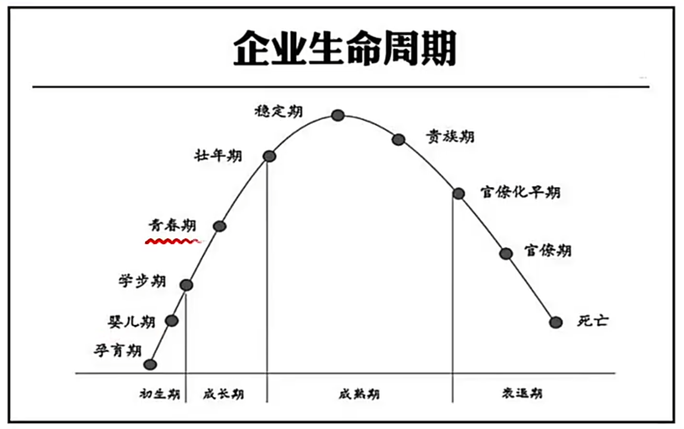
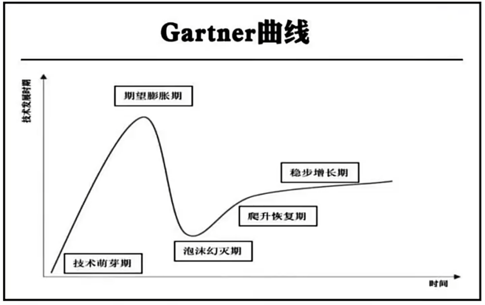
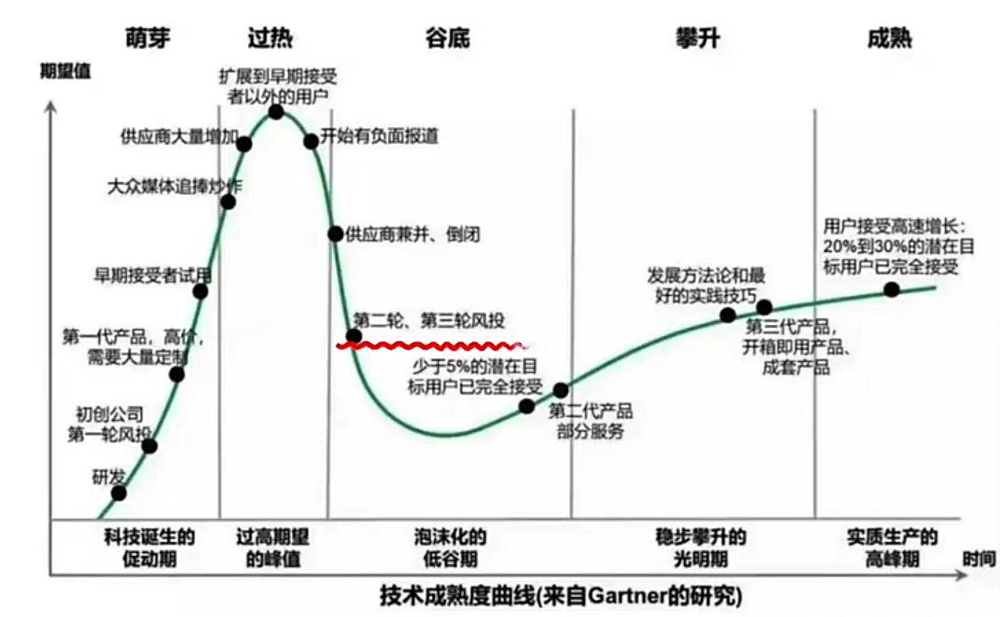
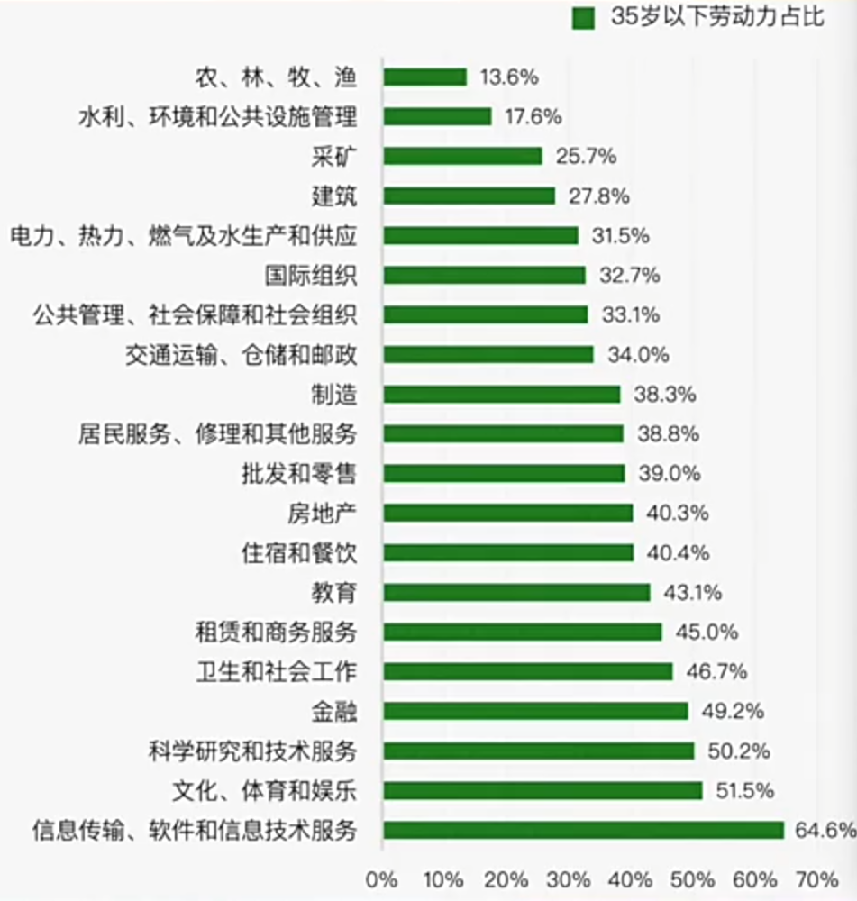
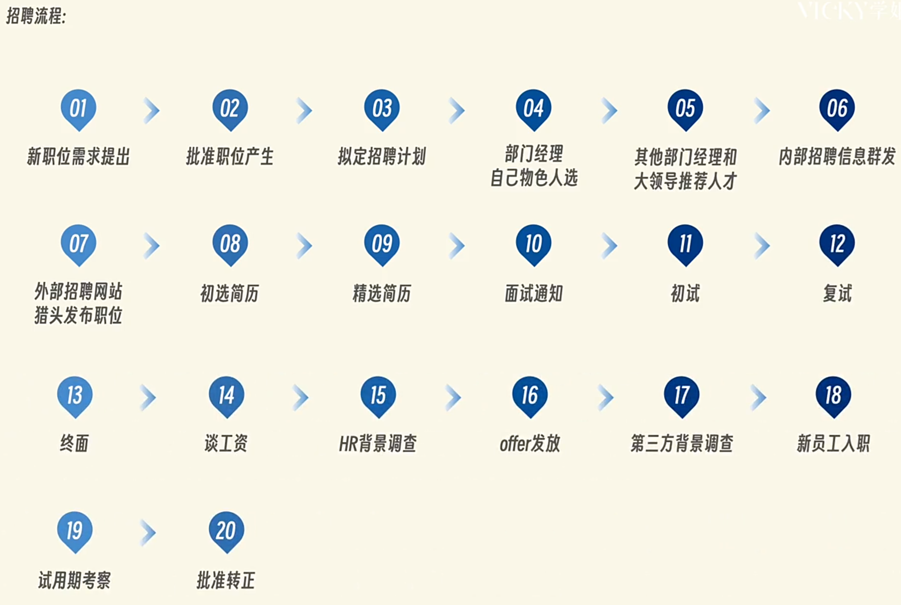

## 草帽未来的内容

**四大板块:**  
### [赛道](#赛道选择)  
### [副业](#副业选择)  
### [实习](#实习选择)  
### [职场能力](#职场能力培养)  

[AI工具](#ai工具)  [海南封关](#海南封关)
### 一个原则:这些东西不是用来学的,是用来做的.  

## 赛道选择  

### 风口预测的底层逻辑  

"一个人的成功,在于他进入了一个上升的行业,在上升的行业中,你不需要太聪明,也不需要太勤奋,行业会拖着你走" -- 查理·芒格

三个圈定律:  
1. **宏观政策**.(跟着国家政策走)   
2. **市场**.(市场经济是看不见的手,具体来说是钱往哪个方向走)   
3. **个人**.(个人能力模型,知识储备,个人兴趣爱好)  

中心点是**风险**.风险是1,其他是0,风险把控至关重要.  

具体来说:  
1. **看市场规模**,选市场规模更大的赛道.  
2. **看市场集中度**,不建议市场规模集中的行业,例如电商行业市场集中度极高.  
3. **看行业增速**,避免增速为负的行业,**比对国家GDP增速和行业增速**.  
4. **看利润**,查看公司财报,公司都不赚钱,就业肯定会更困难.  

挑完行业挑公司,看企业.  
  
  
  
  
存量时代:没有造不出的产品,只有卖不出的产品.  

分工的利润分布在生产端和销售端,**技术人才就夯实基础**,销售人才就多走出去,运输端管控风险,但更接近利益分配端,会更容易利己.  

所有的数据来源可以看行业报告,**例如[证监会](http://www.csrc.gov.cn/)**.  
BAT数据平台:  
[阿里研究院](http://www.aliresearch.com/cn/index)

### 好赛道 
1. 含咖啡因饮料.  
2. 美妆.  
3. 博彩.  
4. 二手/平替.  
5. 旅游.  
6. 殡葬.  
7. 生殖辅助.  
8. 私密护理.  
9. 冷链物流.  
10. 新能源:**风光车储氢核**.   

### 城市选择

1. 按GDP选择城市(**总量和增量**).   
2. 按产业和专业推荐.  
3. 小本生意的产业集群.   

直接看报告  
```
搜索关键词:  
1. 年份+省份+产业增速.  
2. 年份+省份+产业集群.  
3. 年份+省份+GDP增速快的原因.  
```

直接看人口聚集

```
长三角城市群.  
珠三角城市群.  
京津冀.  
成渝都市圈.  
西部中心城.  
```

### 可能高薪酬的行业

一个点:如何成为一个产品经理:有研发思维,做虚拟产品的研发和服务,懂得管理,用产品化的思维来做产品然后来做销售.  

### 人才认证

查看人才计划  
1. 搜公众号.  
2. 官网: **某某市 + 人社局**  
3. 微信: **城市名称 + 人才认定/人才认证/人才评级**

查看各地区的人才评级,ABCDE类人才的要求是什么,比如E类人才需要在专项技能上获得名次.  

在当前文凭通胀的情况下,获取专项技能或许比获取研究生毕业证重要.  

也要顺应周期,行业的发展周期规律的存在会出现一个现象,IT行业不如传统技能行业的薪酬.  

### 新生儿下降  

一个家庭的最大支出,房子,车子,孩子(四脚吞金兽).  
婴儿代表的是消费力(先)再是劳动力(后). 

1. 对政府的影响:  
影响劳动供应和人口增长从而影响经济增长和就业市场.  
养老金现收现发,交的人少了,发的人多了,财政迟早会入不敷出,对社会保障和养老金系统造成压力(往高新科技转型,推迟退休时间).  

2. 教师行业:  
2024是在校学生的拐点.  
教育者市场正在逐渐缩水.  

3. 老年人赛道:  
银发经济是香饽饽.  
老年大学的本质是社交(心灵上和情绪价值的慰藉是付费成功的关键).  

4. 母婴赛道:  
做高端产品.  
医护人员尽量避免妇产相关岗位.  
儿童消费品需求减少.  

5. 房地产行业:  
未来学区房和房地产会逐渐脱钩.  
娱乐,医疗设施附近的房地产升值空间较大.  

6. 男性消费:
中年男人有三宝:钓鱼,茅台,始祖鸟.  

### 银发经济

用全球的眼光看中国,用产业的眼光看行业,用行业的角度挑公司.  

1. 家政服务行业(认知症照护;相关医疗设备,筛查,陪护等;陪诊师).  
2. 老年消费年轻化.  
3. 养生(专属保健;慢性病;保健食品;康复器具).  
4. 宠物和房地产.

### 跨境电商

前置内容:**直播课2024中央经济工作会议 + 跨境电商大佬的谈话**  

跨境电商有万亿级别的市场规模,对比着看游戏有三千亿,电影2023有600亿.  

1. 外贸是To B的业务:公司对公司;偏线下,交易双方商谈后签订合同,走海关;大宗货物,交易金额大,流程繁琐.  
2. 跨境是To C的业务:公司对用户;线上为主,依赖电商平台交易;更注重运输时间和效率.  

### 自媒体  

前置内容:**从0到1自媒体怎么做 + 如何找对标账号**

财富的机会:从前->公司+渠道 --> 现在->平台+个体.  

1. 腾讯:视频号爆发;2023年整体营收翻倍;30岁以上人群.  
2. 抖音:越接近生活越有流量;游戏,娱乐主播赛道.   
3. 小红书:营销人群,营销生活状态;着手买手经济(女性用品,情绪,玄学,家教).  
4. bilibili:#顺大势逆小势,2023持续亏损;平台核心是变现;目标群体是大学生,年轻用户.  
5. 快手:接地气,做下沉市场;家庭教育赛道;旅游赛道.  

对标账号:明确诉求,找到相似的达人,复制成功模式.  

避雷:不靠谱的课程,养号;流量充值(只能让爆的更爆,不能让一个没有内容的变爆)的目的是定向地增加产品曝光性;陪跑.   

选题:视频爆不爆,选题占80%;学会拆解爆款.  

### 产能过剩的行业

供大于求就是产能过剩  

后果:裁员;公司倒闭;资本不敢投资.

1. 钢铁.  
2. 房地产:玻璃,水泥,多晶硅,煤炭,化工.  
3. 服装行业:衣服库存卖不出去;中古款,定制,小众是未来发展趋势.   
4. 白酒,电器.  
5. 新能源:锂电池价格下跌;汽车行业.  
6. 光伏和储能.  
7. 轮胎.  
8. 猪肉.  
9. 学校,酒店.  


---
---

## 副业选择 

### 副业赛道  
前置内容: **3-3 副业选择, 3-4 财商法则, 3-5 商业思维 + 报喜鸟**  

**一个核心,要探索上下游**.

1. 情趣用品.  
2. 国货美妆/生殖辅助/假发/成人教育.
3. 教育相关:志愿辅助填报.  
4. 手工类型:手工美甲/宠物帽子/书法/手机壳.  
5. 娱乐类赛道:短剧分销/益智玩具/演唱会经济/电商模特.  
6. 玄学:转运手链.  
7. 咸鱼.  
8. 社交类:圈子KOL(key option leader).
9. 代理类.  

---
---

## 实习选择


---
---

## 职场能力培养

### 35岁危机

落户,各种补贴以及深造,买房,公司的优待都要求35岁以下的人群.  
催婚有35岁的心理线,催育有35岁的警戒线,各类医学研究都把35岁最为高龄产妇的分界线.  



1. 技术/职能岗转管理:做好本职工作,再有能力去带团队掌握更多权利,往公司利益链上走(拿股权和分红).  
2. 和直属上级搞好关系:不要越级汇报,但要越级社交.  
3. 培养**市场营销能力**:培养自己直接跟市场交易的能力,从公司跳出来做自己的工作室(**看沟通的课**).    
4. 挖掘有价值的资产:著作权,专利权,IP创作,手艺人.  
5. 存钱的同时学投资.  
6. 利用杠杆:资本,劳动力,自媒体,软件.  

### 跳槽转行

招聘流程:


1. 选好赛道.  
2. 积累行业人脉:细致询问行业从业者什么样的人比较适合这个行业;公域求助;关注行业公众号;直接去面试,获取信息;找圈子.  
3. 反向训练:利用信息茧房,关注你想了解的行业,主动刷,让算法推荐;低成本试错,避免三分钟热度.    
4. 一个重要原则:换行不换岗,换岗不换行.  

离职前的准备:
1. 事以密成,语以泄败.  
2. 离职时间(15号以后),入职时间(15号之前),否则会影响公积金.  
3. 离职申请书(通知书).    
4. 提前薅羊毛,在职期间有稳定的工资流,可以把签证,信用卡提前办好.   
5. 清理私人文件和工作交接证明.  

离职前的证明:
1. 离职证明:盖公司的公章,标注之前的职位,写明离职日期.  
2. 收入证明.  
3. 结束劳动合同证明(被辞退可以领失业保险).  

### 离职操作 

四个维度:**事,人,钱,个人能力**.  

1. 事:行业;公司;能力和工作是否匹配.  
2. 人:领导,同事和下属(职场是一面四处透风的墙);  
3. 钱:工资不到位;  
4. 能力:好公司能学到很多东西;重复低价值的劳动浪费时间.  

不要随便离职:  

1. 不自信导致焦虑辞职.  
2. 情绪性的突发辞职.  
3. 工作犯错辞职逃避.  
4. 领导骂人就辞职.  


---
---


## other

#### AI工具   
会用AI工具,超过工作中50%的人,因为AI掌握的是行业的平均知识.  
使用方法:  
1. 持续性问答.  
2. 角色扮演.  
3. 数据引用,自己给ai数据,或者数据来源.    

尽量给ai更丰富的前驱知识.    

```
例如:
优化简历的场景.  
1. 告诉它行业和岗位,自己的简历内容.  
2. 让他给出简历的优化策略.  
3. 扮演面试官提问.  
4. 调换身份来优化问答结构内容.(我是这个公司的面试官,你是一个非常资深的应聘者,请回答我的这个问题以拿下当前的这份工作)  
```

#### 海南封关

封的是海关,海南会有独立的自由贸易港法,海南封关一线放开,二线管住,岛内自由.  
海南封关面向全球.  
1. 零关税,**将会自己旅游业**.  
2. 教育,**引入国际高校**.  
3. 医疗,**国际医疗越来越多**.  
4. 税收,**海南注册公司的税率低,个税max15%**.  
5. 金融,**资产自由便利流动(属于境外资产)**.  
