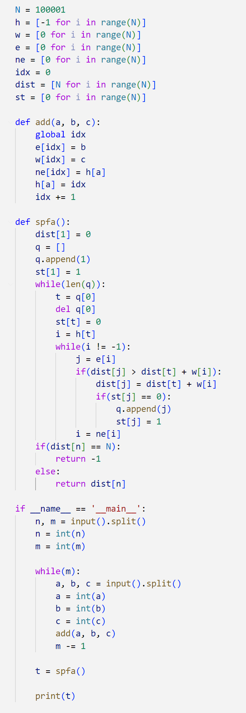
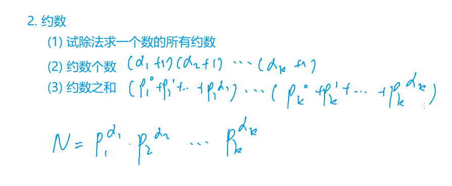
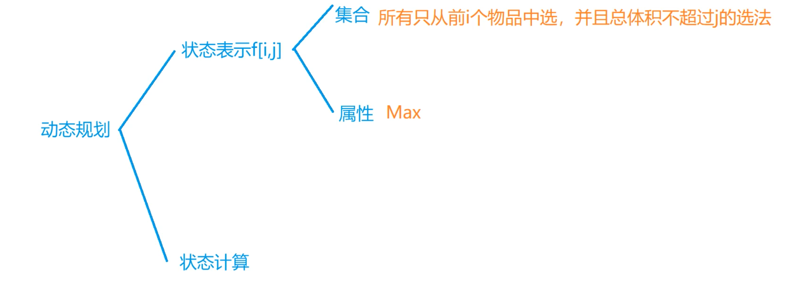

# 蓝桥杯python研究生组备考就是在这里了

<!-- [待学链接](https://www.bilibili.com/video/BV1qW4y1a7fU?p=72&vd_source=5a8651962259df7b14781b1d0370c6a0) -->

### 一些考试的注意事项
* 日期题是必考的.  
* dp状态转移方程要仔细分析,最好用递推的方式,不要用递归.  
* 可以根据数据规模分段处理,例如a∈[0, 1000]用solve1(),a∈[1001,100000]用solve().  
* python:对于多次输出,考虑答案拼接再统一输出,这是一个提升代码运行速度的技巧.   

## 下面是经典的题目和代码  

SPFA：求有负权边的最短路径,维护一个dist数组,用了队列
    

求一个数的约数的个数和约数之和
    

DP的常规思路图
    

## 下面是一些知识点  
* 数据类型转换:直接用int(), str(), float()  
* \+ \- \* \/ \% \//(整除) \**(次方) **eg. a //= 3**  
* 可以使用三引号注释 """中间可以包含多行内容"""   
* python里的print占位符:%s %d %f **eg. print("this is a sample %s and %d" % (one, two))**  
* 数据的精度控制:m.n **eg. print("number is %6.2d" % 23.231) -> out is []23.23**  
* 快速格式化:**print(f"this is a:{value_A}")**  
* python的输入是:**value = input()**,但是数据类型会一直是str
* 位置不定长: **eg. def test(\*args): 传入的参数不限制长度,用args保存,是一个列表**  
* 关键字不定长: **eg. def test(\*\*kwargs): 传入的参数不限制长度,但是要是键值对,用kwargs保存,是一个字典**  
* 函数也可以作为参数传入函数  
* \_\_name\_\_ == '\_\_main\_\_' 可以限制外部文件直接import导致的自动执行问题, \_\_all\_\_可以限制外部import *时所有方法被引入的问题**eg. \_\_all\_\_=['test_a']**  
* 创建一个数组:**list = [0 for i in range(10)]**