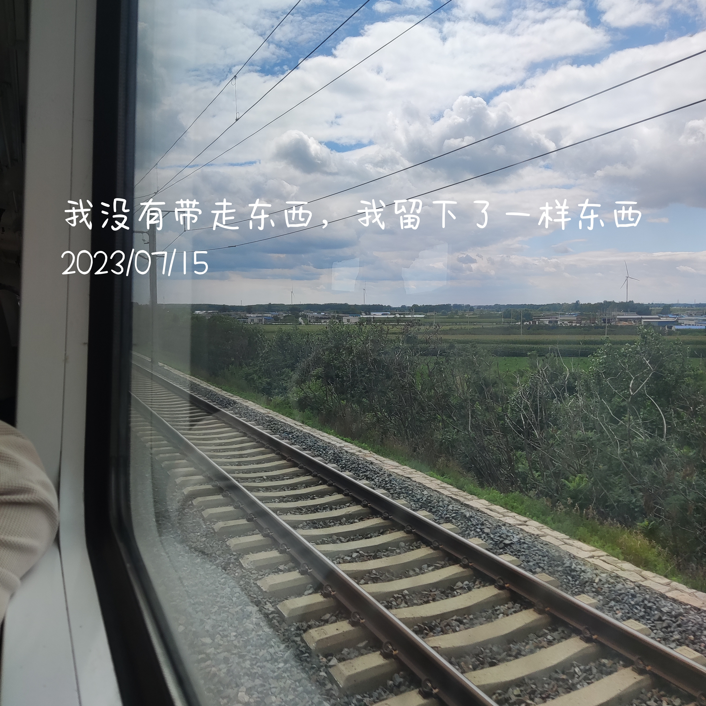
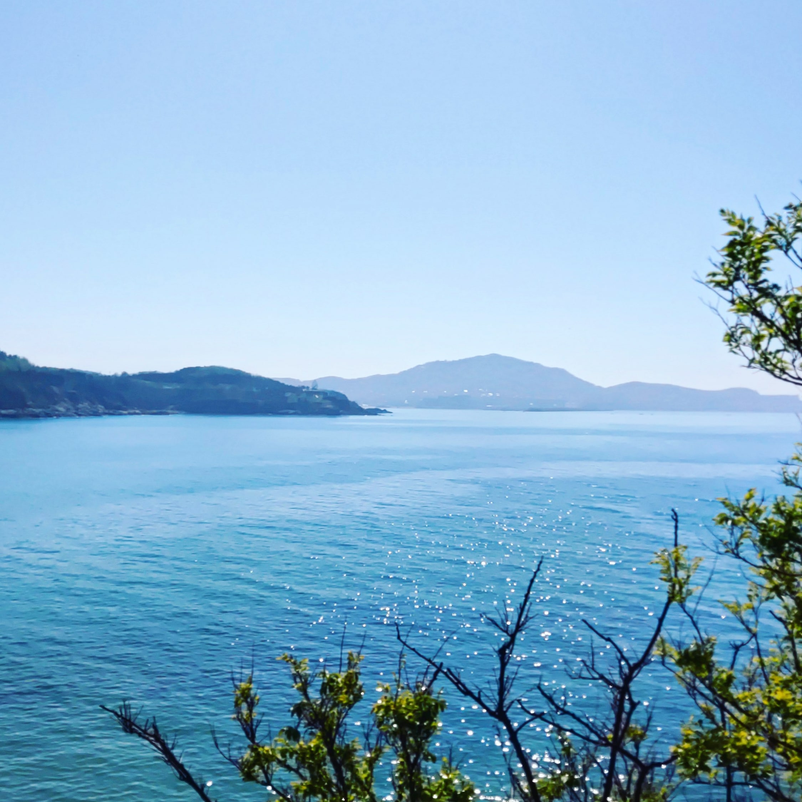
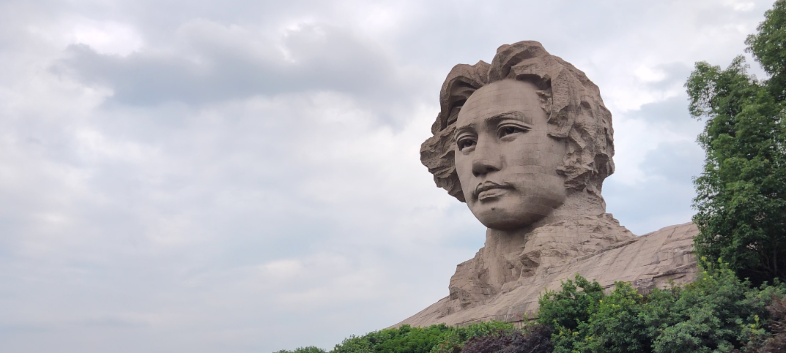

# 就是一些玩耍的记忆

<audio src='./music-tree/OutPlay/胡夏-美好的昨天.mp3' autoplay loop controls></audio>  

### LIST-沈阳行

住宿中街附近(三晚)
出行，公交，地铁（支付宝）
中街 步行街（可步行至，逛逛吃吃）（晚上散步嘿嘿 逛吃逛吃）
富龙快餐(人很多早点去，找找就近去吃)（穿插吃）

到达下午休整一下子。
（向北走，由史入城）
太清宫（第一站，不远，city walk，找找沈阳的节奏）（晚上找烧烤，哈老雪）
918历史博物馆（9-17，公众号提前一天预约，免费）（到沈下午）

（由东向西大行进，感沈阳市井气息）
小河沿早市 六点钟（正宗老式油条，鸡蛋堡猪肉的好吃，小燕豆腐脑，茶蛋和馄饨，早市水果闭眼入）
张氏帅府(8.30-17.30，成人票48)
八经街咖啡小巷（浪漫top，必打卡）
西塔风情街 （吃 酱蟹，韩餐，左耳东北话右耳韩国话）（day1 中午 下午 ）
老北市 （六点半 八点半 凤凰灯会 雪莲豆沙）（day1 晚上）

（向南走）
辽宁省博物馆（9-17，公众号提前一天预约，免费）（day2 上午）
元气汤泉（估计要花一天，必体验，搓澡搓澡！）（day2 中午 - 晚上）
刘老根大舞台（太贵换别家或者电影或者脱口秀，快乐就完事了，熬夜也要去）

（由东向北回家了）
沈阳故宫 50门票（3小时 8.30-18.00 50￥）（回汉上午）

tip：
东北烧烤（必吃，晚上吃）
东北家常菜（鸡架必吃，老雪必喝）
早市（5点起床！），大锅涮串（找搭子拼），沈阳鸡架（家常馆吃），手擀面（进居民区找）
老四季（打卡店）
本地人喝喝：八王寺汽水（大白梨，盐汽水），安梨汁饮料，山里红汁
本地人糖糖：不老林
本地人肠：重工食品俄式茶肠 & 克拉古斯老味肠
雪糕：中街大果 & 德氏冷饮（德氏大奶砖）找景区联名

终极任务：认识一个沈阳朋友 ^-^  

### 整理过去-青岛行

那年国庆,我想去自己真正想去的地方玩一玩,想着把自己强烈的内耗整理整理,也想去见见老同学,然后就去威海和青岛了.  
人少的地方玩起来真的很有趣,人多就没意思了.也跟想见的人说出来十年没说出口的话,也认识了有意思的人,坐了二十小时的火车,第一次在网吧过夜,在陌生的街头喝酒散步,第一次真正安排自己的行程,处理突发事件,主动跟陌生人聊天.这些都很有趣.

### 这里是一个人旅行的开始-长沙行

没有什么是比得上穿过看不到尽头的森林的一瞬间突然看见自己渴求的目标的快乐的.这里是我郑某人喜欢上独自旅行的开始.

