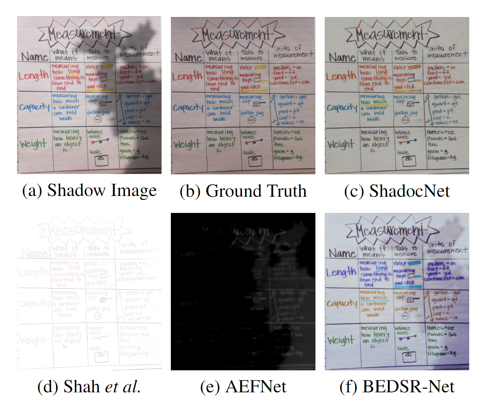
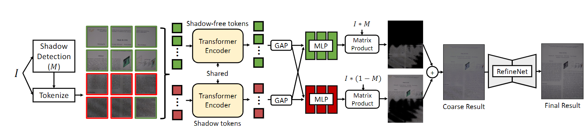
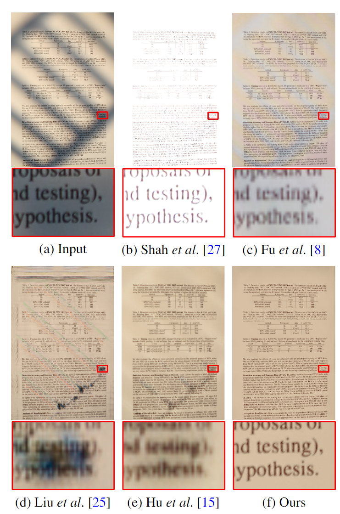
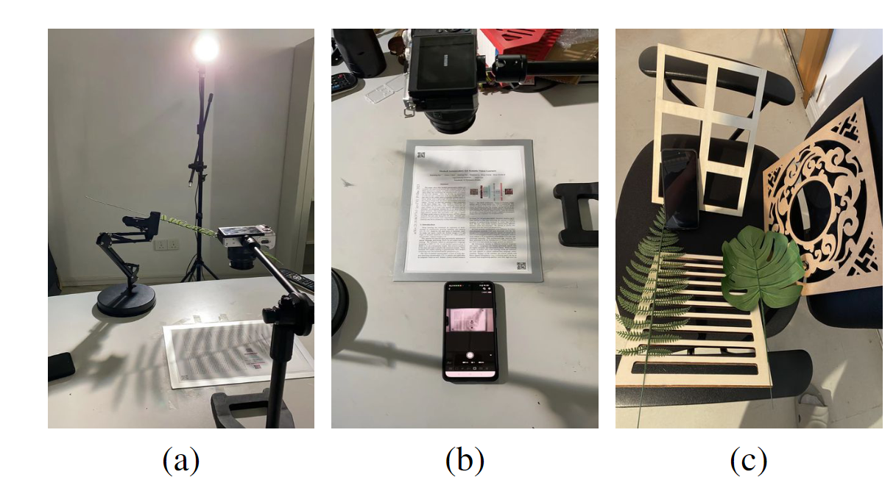
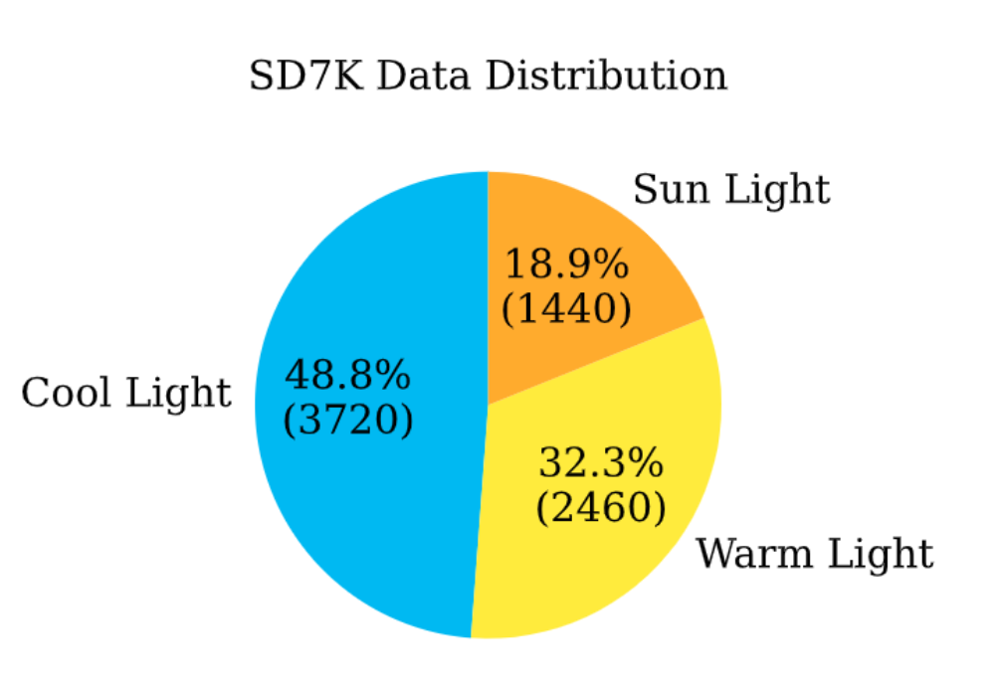
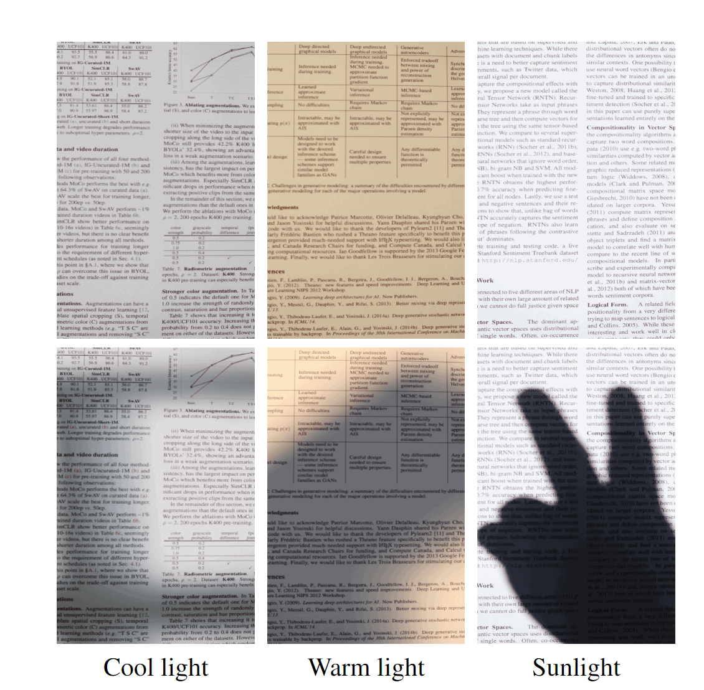
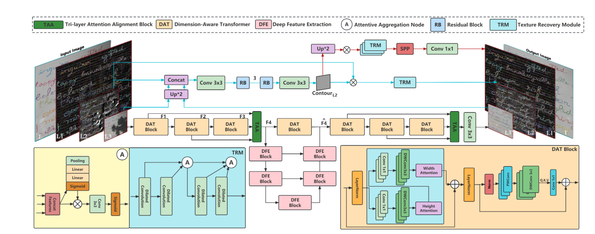
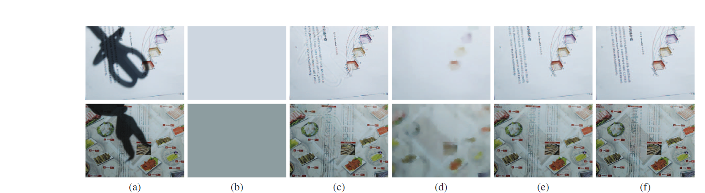
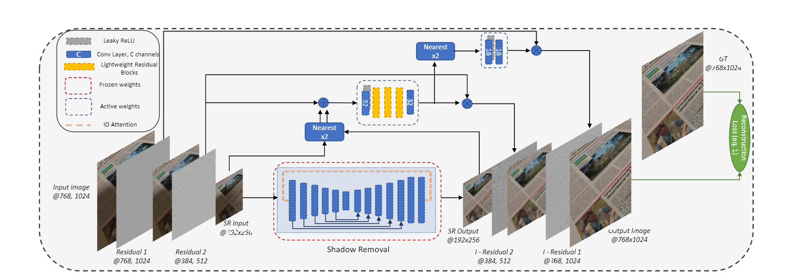

### SHADOCNET: LEARNING SPATIAL-AWARE TOKENS IN TRANSFORMER FOR DOCUMENT SHADOW REMOVAL  
--2023  
```在本文中，我们提出了一种基于 Transformer 的文档阴影去除模型，该模型利用阴影上下文编码和解码在阴影和无阴影区域。此外，阴影检测和像素级增强被包含在整个从粗到细的过程中。在综合基准评估的基础上，与最先进的方法相比具有竞争力。在本文中，我们通过利用特征提取器和颜色渲染模块来提高视觉质量，提出了一种基于 Transformer 的 ShadocNet。1.我们提出了一种鲁棒的文档阴影去除模型ShadocNet，它优于最先进的方法2.我们是使用transformer架构消除文档阴影的先驱```

```
自然图像的阴影去除方法似乎可以转移到文档图像上。实际上，使用上述模型去除文档阴影存在两个问题。对于初学者，他们大多需要一个大型数据集来训练。其次，由于这些方法不使用文档图像的特定属性，因此在这种域转移情况下性能会较差。由于某些模型需要大量的训练数据集，并且只捕获自然图像中的特征，因此它们无法去除文档阴影。
```

  
目前大多数文档阴影去除方法依赖于启发式方法来研究文档图像的某些特征[4,5]。然而，由于人工启发式的固有限制，它们通常对某些图像表现良好，而不是其他图像表现良好。因此，它们的输出通常显示文档图像的不同形式的缺陷，如图 1 (d) 所示   
通过使用大型合成数据集，BEDSR-Net根据背景颜色和阴影注意图[3]的预测来缓解阴影。这是第一个专门为去除文档图像阴影而创建的深度网络。然而，BEDSR-Net 不能完全恢复适当的无阴影图像，如图 1 (f) 所示。 
  
ShadocNet的网络结构。它由三个部分组成:阴影检测模块、阴影颜色重映射的全局阴影重映射和提高视觉质量的RefineNet。

由于之前的阴影检测方法大多是为了自然去除阴影而设计的，我们重新训练了一种基于学习的方法[11]来提取文档图像上的阴影蒙版。它首先提取编码精细细节和语义信息的分层特征映射。然后，方向感知空间上下文(DSC)模块收集定向空间上下文。DSC和卷积特征被连接并上采样到原始图像大小。它使用卷积层和深度监督将上采样特征映射集成为多层次集成特征，以预测每层的分数图。最终的阴影地图包含了所有预测的分数地图。  
在提取单幅图像阴影后，我们的目标是基于假设投射阴影是由一个均匀的光源形成的基础上重新映射阴影区域的颜色，灵感来自图像调和citeliang2021spatial。因此，我们采用视觉转换器(vision transformer, ViT)[13]来实现上述目标。具体来说，我们首先将原始图像标记为基于补丁的标记，然后利用从上一步提取的掩码将所有的补丁嵌入分为两组，其中仅包含阴影或无阴影的标记嵌入。    
在此之后，我们使用 transformer 计算这些域感知补丁嵌入的自注意力，从而为阴影和无阴影区域嵌入域感知区域。我们采用全局平均池化层 （GAP） 来构建前景和背景全局表示，因为掩码仍然包含误差分割，并且基于补丁的表示不是像素级的。  
在获得领域感知令牌后，我们开发了 MLP，这是一种简单而有效的像素映射函数，用于将每个区域的原始颜色像素重新映射到其新值。由于阴影通常是由均匀的照明引起的，因此阴影区域的颜色变化将具有可比性。因此，MLP 将每像素值传输到恢复的无阴影区域，以便重新创建图像。
在获得域感知令牌之后，我们开发了MLP，这是一个简单而有效的像素映射函数，可以将每个区域的原始颜色像素重新映射到它们的新值。由于阴影通常是由均匀照明产生的，因此阴影区域的颜色变化将具有可比性。因此，MLP将每像素值转移到恢复的无阴影区域，以重建图像。    

---
我们认为文件阴影移除是一个有监督的问题。特别是，我们在合成区域中计算目标和相应生成图像之间的差(对于每一步)。因此，我们使用相对于前景阴影掩模M的预测前景和目标之间的相对L1损失。此外，为了提高视觉质量，我们将多层感知损失[16]纳入了我们的框架。下面是每个组件的细节。

---

我们采用均方根误差(RMSE)，峰值信噪比(PSNR)和结构相似性(SSIM)。对于内容保存评估，我们评估了光学字符识别(OCR)技术在无阴影恢复图像上的有效性。原则上，如果文档恢复得更好，OCR应该能够识别更多的内容。  

</br>  
    
### High-Resolution Document Shadow Removal via A Large-Scale Real-World Dataset and A Frequency-Aware Shadow Erasing Net  
--2023  

在本文中，我们解决了从高分辨率文档中去除阴影的问题。为了实现这一目标，我们考虑数据集和网络的贡献。至于数据集，我们收集了一个高分辨率数据集 SD7K，该数据集由超过 7000 多个真实文档图像组成，在不同的光照条件下具有不同的特征。该数据集比以前的数据集大一个数量级，并允许我们以更多样化和更全面的方式验证我们的方法。至于网络结构，我们提出了 FSENet，这是一种频率感知的方法，通过频率分解去除更高分辨率的阴影。我们采用 LP 和一系列精心设计的注意块，使每个组件能够单独学习。借助我们的数据集和网络，我们的方法实现了一种新的最先进的文档阴影去除方法。我们相信网络结构和数据集都将有利于该主题的研究社区。

最近的方法将深度学习应用于这项任务，因为它在自然阴影去除[6]和其他计算机视觉任务[12，13，35]方面取得了显著进展。然而，几个障碍使得将以前的自然阴影去除方法转移到文档域具有挑战性。一方面，与自然阴影去除相比，文档是由现实世界中的高分辨率图像呈现的，这需要保留字体和图形等细粒度信息。然而，大多数文档阴影去除方法[24,4]仅针对相对低分辨率的图像设计，很难直接处理高分辨率的情况，因为它们依赖于注意的低分辨率近似来指导。另一方面，目前还没有专门为此时文档阴影去除而设计的大规模和高分辨率数据集。因此，给定用于训练的有限图像对，现有方法通常会导致不同的伪影（如图 1 (c) 所示）。尽管弱监督 [18] 和无监督 [15, 25] 阴影去除方法减轻了数据的要求，但它们对阴影和未阴影区域之间的统计相似性有很强的假设。如图 1 (d) (e) 所示，一旦训练域与测试非常不同，这些方法会产生幻觉内容，并且结果不稳定。


输入文档阴影图像(a)、经典方法(b)、监督方法(c)、弱监督方法(d)、无监督方法(e)和我们的(f)的视觉结果。我们的模型在保持原始文档内容和纵横比的同时去除了阴影

```我们将主要贡献总结如下:1.我们提供了SD7K，这是一个由高分辨率阴影和不同光照条件下相关的无阴影图像组成的大规模真实数据集。2.我们提出了 FSENet，这是一种频率感知网络，具有精心设计的网络结构来处理高分辨率文档阴影。3.所有可用公共数据集的定性结果和定量结果表明，所提出的 FSENet 优于最先进的方法。```

首先，我们使用佳能EOS M6相机从现实场景中捕获打印的文档图像。为了捕捉成对的阴影和无阴影图像，我们将所有光线都接近并留下一个光源。相机的所有设置也是固定的，包括焦距、光圈、曝光和ISO，以避免相机算法的影响。然后，我们使用相机站拿着相机，使其垂直拍摄纸，如图 2 (a) 所示。为了捕获成对的阴影和无阴影图像，不涉及手动按下引起的变化，如图 2 (b) 所示，我们使用遥控器通过移除遮挡器来捕获有阴影和无阴影纸张之间的照片。我们还尽可能缩短对，以避免捕获之间的光差。
为了进一步增强多样性，我们在捕获几批文档后交替文档和遮挡器的位置。总体而言，我们使用超过 30 种类型的遮挡物以及超过 350 个文档对数据集做出贡献，一些遮挡物如图 2 (c) 所示。这些遮挡物具有规则形式和不规则形式的形状，为各种情况提供了足够的覆盖，我们计算了整个数据集的阴影区域百分比，为 4.38% ± 13.58%，表明对于我们的阴影去除任务来说，它足够发散。  
我们还考虑了阳光强度的波动和阴影的随机放置，这将受到光变化的显着影响。为了模拟不同光源下的结果，我们在数据集中引入了三种类型的光源进行收集，包括固定太阳光、色温为 3000K 的固定 80W LED 黄光和色温为 6000K 的固定 80W LED 白光。整个数据集的光分布如图3（b）所示。

图 2. (a) 用于构建数据集的数据采集设置。(b) 远程电话控制快门，用户只需要单击按钮来捕获一对无阴影/阴影图像。(c) 我们的遮挡物的一些展示。

  

光分布    

出于数据清理目的，我们首先删除具有明显运动失真或缺乏焦点的图像。由于有些照片仍然包含异常值，上下文是重复的，然后我们回顾组中的照片并删除它们。最后，我们裁剪文档边缘之外的区域，总共产生了7620个样本，其中一些样本如图4所示。我们还使用基于阈值的方法来提取训练对的掩码，因为阴影掩码也将有利于相关任务。  


SD7K 的示例阴影和无阴影图像



</br>

### Document Image Shadow Removal Guided by Color-Aware Background

```在本文中，我们提出了一种颜色感知背景提取网络（CBENet），用于提取准确描述文档背景颜色的空间变化背景图像。此外，我们提出了一种背景引导的文档图像阴影去除网络(BGShadowNet)，利用预测的空间变化的背景作为辅助信息，包括两个阶段。在第 I 阶段，设计了一个背景约束解码器来促进粗略的结果。然后，使用基于背景的注意模块(BAModule)对粗结果进行细化，以保持一致的外观和细节改进模块(DEModule)，以增强第二阶段的纹理细节。1.我们提出了一个颜色感知的背景提取网络(CBENet)，用于估计空间变化的背景图像，以指导文档图像的阴影去除。2.我们提出了一个名为 BGShadowNet 的框架，用于文档图像阴影去除，该框架充分利用了背景图像，并且能够稳健地生成高质量的阴影去除结果。3.我们设计了一个基于背景的注意模块(BAModule)，以保持一致的外观和细节增强模块(DEModule)来增强纹理细节。```

由于文档图像主要关注文本内容，执行文档图像阴影去除的常用策略[2,24]是利用从图像中提取的背景层，只包含没有文本内容的图像颜色信息。这些方法假设文档具有恒定的颜色背景（论文的颜色），如图 4(b) 所示。但是在恒定的颜色背景和图像之间可能存在差异。例如，由于颜色打印，可能存在其他背景颜色，如图 4(a) 所示。恒定背景会导致不满意的结果，如图 4(c) 所示。



我们采用 U-Net 结构来实现我们的 CBENet。U-Net首先应用5个Conv+BN+LRReLu从图像中提取特征。然后，它采用五个具有批量归一化和 ReLU 激活函数的反卷积层来预测背景图像。在卷积层和反卷积层之间应用跳跃连接，增加网络中的通道数并保留前一层的上下文信息  

如前所述，背景可以提供一些有用的信息来促进阴影去除。因此，我们提出了一种背景引导的阴影去除网络(BGShadowNet)，利用背景图像作为补充信息。如图 2 所示，我们的 BGShadowNet 包括两个阶段。在第 I 阶段，除了图像编码器外，还引入了背景约束解码器来产生粗略的阴影去除结果。在第二阶段，为了提高粗结果并产生最终的无阴影图像，将基于背景的注意模块(BAModule)和细节增强模块(DEModule)嵌入到编码器-解码器网络中。最后堆叠鉴别器以区分生成的图像是真实的。我们选择DenseUnet[32]和马尔可夫鉴别器[17]作为我们的编码器-解码器结构和鉴别器。

在本文中，我们提出了一个 CBENet 来估计阴影图像的空间变化的背景，这有助于所提出的 BGShadowNet 执行文档阴影去除。我们的 BGShadowNet 首先使用背景约束解码器预测粗略的阴影去除结果。然后，我们将BAModule和DEModule嵌入到编码器-解码器网络中，以提高粗结果，产生最终的无阴影结果，具有一致的外观和细节丰富的纹理。将我们的 BGShadowNet 与最先进的方法进行比较的实验证明了它的优越性。

</br>

### LP-IOANET: EFFICIENT HIGH RESOLUTION DOCUMENT SHADOW REMOVAL

```首先，大多数现有方法通常不针对轻量级解决方案。其次，大多数方法没有以高分辨率运行。第三，文档图像有多种形式，例如纯文本无色文档和彩色/图形繁重文档，这在野外需要良好的性能。最近的工作 [4] 以端到端的方式解决了文档阴影去除，但是，它与没有以高分辨率运行的大型模型这样做。我们工作的贡献如下：我们提出了 i） IOANet，一个具有实时操作输入/输出注意力的文档阴影去除网络，ii） 一个封装 IOANet 的轻量级上采样模块，让我们以高分辨率运行，iii） 三个涵盖各种照明条件、文档类型和视点的新数据集，以及 iv） 一个两阶段训练管道，让我们可以利用任何低分辨率数据集来改进泛化。我们的 LPIOANet 轻松胜过最先进的设备，在移动设备上实时运行，分辨率是最先进的分辨率的 4 倍。最先进的方法内存不足，因此即使在 24GB VRAM 桌面 GPU 上也无法运行。LP-IOANet的示意图如图1所示。我们提出了 LP-IOANet，这是一种端到端、轻量级的高分辨率文档阴影去除解决方案。它由 IAANet 组成，这是一种阴影去除架构，封装在轻量级上采样器中。我们还提出了三个新数据集，这有助于我们的模型泛化到野外场景。我们的结果表明，LP-IOANet在移动设备上以高分辨率实时运行时，性能优于现有的最先进的技术。```

与当前最先进的BEDSR[4]相比，我们的工作有几个关键的优点:我们i)在训练过程中不需要背景颜色标签，ii)显式地解决高分辨率输出要求，iii)通过我们的新数据集扩大数据分布，iv)不使用大型、复杂的架构。我们的管道也是通过修剪/量化进行优化的主要候选者，因为它使用简单的构建块，而 BEDSR 在推理中需要梯度信息 [9]，这在手机等资源受限的环境中很难获得。这种优化对于未来的工作很有趣，但不是在我们的范围内。

  

我们的 LP-IOANet 管道。在低分辨率(见图2)中阴影去除网络(红色虚线)的训练之后，我们冻结它，并在我们提出的A-BSDD数据集上训练我们的轻量级上采样模块(蓝色虚线)。  

我们提出了 LP-IOANet，这是一种端到端、轻量级、高分辨率的文档阴影去除解决方案。它由 IOANet 组成，这是一种阴影去除架构，封装在轻量级上采样器中。我们还提出了三个新的数据集，这有助于将我们的模型推广到野外场景。我们的结果表明，LP-IOANet在移动设备上以高分辨率实时运行时，性能优于现有的最先进的技术。

</br>

### ScannerNet: A Deep Network for Scanner-Quality Document Images under Complex Illumination

本文介绍了ScannerNet，这是一种利用深度学习消除复杂光度失真的综合方法。为了利用阴影和阴影的不同特征，我们的模型由一个用于阴影去除的子网络和一个用于阴影校正的子网络组成。为了训练我们的模型，我们还设计了一种数据合成方法来有效地构建具有大量变化的大规模文档数据集。我们广泛的实验表明，我们的方法通过去除阴影和阴影、保留图形颜色和提高易读性来显着提高视觉质量。 

本文提出了ScannerNet，这是一种利用深度模型校正文档图像复杂光照分布的综合方法。我们的方法由两个子网络组成，以逐步去除阴影和阴影。首先，DeshadowNet通过去除阴影创建了一个均匀照明的中间图像;然后，DeshadingNet纠正剩余的阴影和颜色偏移，以产生扫描质量的文档图像。我们提出了一种使用掩码组合生成训练数据的方法，以训练具有大量多样性的模型。这种合成流程的计算成本相对较低。因此，数据集可以轻松扩展。我们的实验表明，我们的方法在去除文档阴影和校正阴影方面更有效，从而以显着的方式提高视觉质量。

```我们的目标是通过校正光度失真来获得具有扫描仪质量的文档图像。阴影往往会产生清晰的轮廓和过渡，而阴影通常以更平滑的过渡和颜色偏移来表征。因此，我们提出了ScannerNet，这是一个两阶段网络，可以不同阶段的阴影和校正阴影。为了提供监督信号，我们提出了一种灵活有效的合成图像三元组方案。• 我们设计了一个快速、灵活和有效的数据合成过程来生成合成训练数据。这个过程的计算成本很低，可以根据产生的光度失真的类型和变化轻松控制。因此，用各种各样的照明失真来丰富数据集要容易得多。• 在合成数据的帮助下，我们提出了一种轻量级有效的深度网络来去除文档图像上的阴影、不均匀的阴影和整体颜色偏移。• 实验表明，我们的方法在 OCR 方面产生了具有更高阴影和阴影去除性能、图形颜色保存以及提高感知质量和可读性的扫描质量文档图像。```

文档着色校正。许多算法专注于去除扫描图书的脊柱区域的阴影[15,19,23,25,26]。为了重建表面几何形状及其照明，一种常见的策略是使用来自阴影的形状思想[23,25,26]。因为这些方法依赖于扫描仪和书籍之间的先验几何设置，因此它们不能应用于基于相机的文档图像。其他方法，如Lee等人[15]，通过融合多个边缘图并通过插值背景颜色来计算阴影图来检测前景对象。孟等人。 [19] 基于背景颜色定义了一个凸包，并使用它来估计文档的阴影。最近，已经探索了数据驱动的方法 [6, 7, 16] 来增强文档图像。Li等人[16]和Das等人[6]都解决了文档图像的几何和光照校正问题。他们的方法首先通过神经网络估计 3D 失真或形状，以纠正文档的几何形状。然后使用第二个网络来纠正照明。Das等人[7]专注于照明校正，估计每像素白平衡内核，并使用内在分解去除阴影。由于它们的阴影合成过程没有考虑遮挡器，这些方法对于包含暗阴影边界的文档效果较差。
文档阴影去除。一些方法可以去除文档图像的暗阴影。Jung等人[12]利用像素亮度构建地形表面，利用扩散方程模拟浸泡过程来估计文档上的阴影伪影。他们的方法倾向于产生整体颜色偏移的结果。Kligler等人[13]将图像像素表示为3D点云，并提出了一种可见性测试算法来检测文档图像中的阴影和污渍。生成的可见性图可以提高其他算法的结果，包括文档二值化和阴影去除。然而，结果经常观察到残留的阴影边缘。\

每个图像对都包含同一文档的两个图像：第一个是在复杂光照下的相机拍摄的，第二个是用扫描仪扫描的。

</br>

### DOCUMENT SHADOW REMOVAL WITH FOREGROUND DETECTION LEARNING FROM FULLY SYNTHETIC IMAGES

```我们提出了 FSDSRD，这是一个大规模的多样化完全合成数据集，由各种场景中的阴影图像、无阴影图像、阴影蒙版和前景蒙版组成，而不使用捕获的真实文档图像。• 我们表明，（预训练）对所提出的完全合成数据集进行训练比在有限的真实数据集上进行训练会产生更有效的网络。•我们提出了一种新的网络，该网络使用前景信息进行阴影去除。实验结果表明，我们的模型取得了较好的效果。在本研究中，我们首先创建了一个完全合成数据集 FTSRD，而无需捕获真实文档的成本。实验结果表明，深度神经网络能够通过在我们的 FTSRD 上进行训练或预训练来去除真实图像上的阴影。然而，FSDSRD 不包括各种彩色阴影，这限制了通用深度神经网络在这些领域的性能。为了使 FSDSRD 更加多样化，我们希望在未来考虑各种彩色阴影来扩展它。最后，我们还证明了所提出的网络优于其他方法，并在训练期间使用前景图可以提高网络的性能。```

</br>

### BEDSR-Net: A Deep Shadow Removal Network from a Single Document Image

```本文提出了背景估计文档阴影去除网络(BEDSR-Net)，这是第一个专门为文档图像阴影去除而设计的深度网络。为了利用文档图像的特定属性，设计了一个背景估计模块来提取文档的全局背景颜色。在估计背景颜色的过程中，该模块还学习了关于背景像素和非背景像素空间分布的信息。我们将这些信息编码到注意力图中。利用估计的全局背景颜色和注意图，阴影去除网络可以更好地恢复无阴影图像。我们还表明，在合成图像上训练的模型对真实照片仍然有效，并提供大量文档的合成阴影图像及其相应的无阴影图像和阴影掩模。在几个基准上的大量定量和定性实验表明，BEDSR-Net 在提高文档图像的视觉质量和可读性方面优于现有方法。• 我们提出了第一个深度学习方法来阴影去除文档图像，其性能优于最先进的方法。通过探索文档图像的具体属性，我们的模型估计背景颜色和注意力图作为第一步。这些信息被证明有助于提高图像质量和减少模型参数。此外，通过探索注意力图，所提出的模型不需要阴影掩码进行训练，减轻了收集训练数据的工作量，减少了掩码不准确的风险。• 我们提供了一个由阴影图像、对应的无阴影图像和阴影掩码组成的大规模图像三元组数据集。这些图像是用图形渲染器合成的。将发布源代码、数据集和预训练模型。• 我们表明，通过对不同研究小组收集的不同特征真实图像的彻底实验，在合成图像上训练的深度模型对真实图像仍然有效。```

本文提出了第一种基于深度学习的文档图像阴影去除方法。为了解决训练数据的第一个问题，我们建议使用合成图像。这样，获得变化很大的大规模训练集要容易得多。通过广泛的实验，我们表明在合成图像上训练的深度模型对于真实世界的图像仍然有效。

本文介绍了一种基于深度学习的单张文档影像去除阴影的方法，并提出了BEDSR-Net模型来进行实现。该模型包括一个背景颜色估计网络和一个阴影去除网络，并且利用了注意力图来指示阴影的位置。作者使用了合成的文档影像数据集和真实的文档影像数据集来评估该方法，结果表明该方法在视觉质量和文档可读性方面均优于现有方法。

"依赖合成数据集：虽然论文提出了使用合成数据集进行训练以解决真实数据集较小的问题，但是合成数据集可能无法完全捕捉真实世界中的复杂光照条件和阴影效果。这可能导致模型在处理真实图像时表现不佳。
假设文档具有单一背景颜色：论文中的方法主要基于文档具有单一背景颜色的假设。然而，在现实世界中，有些文档可能具有多种背景颜色或复杂的背景图案，这可能会影响模型的性能。
仅适用于文档图像：虽然这篇论文针对文档图像的阴影去除进行了深入研究，但是其方法可能无法直接应用于其他类型的图像，如自然图像或医学图像。
对阴影的去除效果有限：尽管论文中提出的方法在大多数情况下都能有效地去除阴影，但是在某些特定情况下（如文档完全在阴影中或具有复杂阴影效果），模型可能无法完全去除阴影。
依赖预训练模型：论文中使用的ST-CGAN方法依赖于预训练的模型，这可能导致在处理特定类型的文档图像时性能较差，因为这些预训练模型可能没有考虑到文档图像的特定特征。"