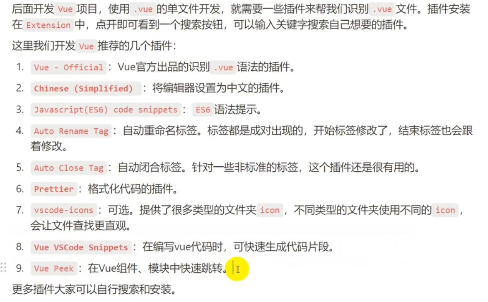

# 这里是 AI-PyTorch 和 DJANGO 入门

机器学习的一些基本概念:  
当然，我会为每个技术点提供更详细的解释：

### 机器学习基础概念

1. **线性回归 (Linear Regression):**

   - **概念和原理**：线性回归用于分析两个或多个变量之间的线性关系，其目标是找到最佳拟合线。公式为 **y=β0​+β1​x+ϵ** ，其中 ϵ 是误差。
   - **方法**：最小二乘法用于找到使得预测值与真实值之间误差平方和最小的参数。
   - **派生知识**：
     - **多元线性回归**：扩展到多个自变量。
     - **过拟合和欠拟合**：模型对训练数据是否过于复杂或简单。

2. **逻辑回归 (Logistic Regression):**

   - **概念和原理**：用于分类问题，输出值在 0 到 1 之间，使用 Sigmoid 函数将线性组合投射到概率值上。
   - **方法**：通过优化逻辑损失函数来确定模型参数。
   - **派生知识**：
     - **多项逻辑回归**：用于多分类问题。
     - **正则化技术**：L1、L2 正则化用于防止过拟合。

3. **支持向量机 (SVM):**

   - **概念和原理**：通过最大化数据点到决策边界的最小距离（间隔）来实现分类。
   - **方法**：使用核函数将数据映射到高维空间，线性不可分的数据可线性分割。
   - **派生知识**：
     - **软间隔**：允许有误分类以增强泛化能力。
     - **支持向量和核技巧**：在高维空间中使用核函数进行分类。

4. **贝叶斯定理 (Bayes' Theorem):**
   - **概念和原理**：通过先验概率和似然函数计算后验概率。
   - **方法**：**P(A∣B)=P(B∣A)P(A)/P(B)**
   - **派生知识**：
     - **先验概率与后验概率**：初始估计和更新后的估计。
     - **全概率公式**：综合考虑所有可能性。

### 树模型

5. **决策树 (Decision Trees):**

   - **概念和原理**：通过一系列测试条件（节点）进行分类或回归。
   - **方法**：选择具有最高信息增益或最低基尼指数的特征进行分支。
   - **派生知识**：
     - **剪枝技术**：去除冗余节点防止过拟合。
     - **树的深度影响**：深度越大越可能过拟合。

6. **随机森林 (Random Forest):**

   - **概念和原理**：集成方法，构建多个决策树并通过投票做出最终决策。
   - **方法**：使用 Bagging（自助采样）增加模型稳定性和准确性。
   - **派生知识**：
     - **特征重要性评估**：哪些特征对预测结果贡献最大。
     - **减少过拟合**：通过多样性降低单个模型的误差。

7. **GBDT (Gradient Boosting Decision Tree):**
   - **概念和原理**：序列地训练弱学习器，每个新模型对前一个模型的残差进行拟合。
   - **方法**：利用梯度下降优化损失函数。
   - **派生知识**：
     - **学习率**：降低单个学习器的权重以提高模型鲁棒性。
     - **弱学习器**：通常是简单的决策树。

### 优化技术

8. **梯度下降 (Gradient Descent):**

   - **概念和原理**：通过迭代调整参数以最小化损失函数。
   - **方法**：计算损失函数的梯度并沿梯度方向更新参数。
   - **派生知识**：
     - **学习率调节**：过大或过小都会影响收敛。
     - **梯度爆炸和消失**：特别是在深度网络中需要注意。

9. **损失函数 (Loss Function):**
   - **概念和原理**：度量预测不准确的程度。
   - **方法**：常见的有均方误差(MSE)用于回归，交叉熵用于分类。
   - **派生知识**：
     - **目标函数**：通常与损失函数相同，用于优化。
     - **优化目标**：找到最低损失的参数组合。

### 评估指标

10. **评估指标:**
    - **概念和原理**：用于衡量模型的预测能力。
    - **方法**：
      - **准确率 (Accuracy)**：预测正确的比例。
      - **精确率 (Precision)**：预测为正样本中实际为正的比例。
      - **召回率 (Recall)**：实际为正样本中预测为正的比例。
      - **F1-Score**：精确率和召回率的调和平均。
    - **派生知识**：
      - **混淆矩阵**：结合准确率、精确率和召回率的基础。
      - **ROC 曲线**：评估分类模型性能的曲线。

### 学习速率

11. **学习率 (Learning Rate):**
    - **概念和原理**：决定参数更新速度。
    - **方法**：通常设置为一个小值并根据需要使用学习率调度策略。
    - **派生知识**：
      - **学习率衰减**：动态调整以避免错过最优值。
      - **自适应学习率算法**：如 Adam，自动调整步长。

我会生成一个 PDF 给您详细学习。请稍等。

[用一个分类的模型来说明 PyTorch 和代码结构](https://www.bilibili.com/video/BV1zfp4eoEAy/?share_source=copy_web&vd_source=9f676f17c5917ccaa93f01729ffd0b8e)

统一用 conda 来管理环境.  
使用**conda info -e**来查看当前 conda 管理的环境.  
使用**torch.cuda.is_available()**查看 cuda 的可用状态.

使用 conda ： **conda install pytorch torchvision torchaudio pytorch-cuda=11.8 -c pytorch -c nvidia**来安装 torch.  
删除 conda 虚拟环境 ： **conda env remove -n d2l-zh **.

代码中一些没有返回值的.()动作大概率是将 xx 置于.xx()状态.

with torch.no_grad():上下文管理器,让推理过程不改变模型参数,对中间的代码进行限制.

优化器 optm 部分的逻辑:我先把模型中可以学习的参数拿到,然后调用优化器并把这些参数传给优化器,这样一个优化逻辑就完成了.

loss.backword 实际上是对损失求导.

optimizer.step()是对优化器进行更新.

一轮 epoch 可以有很多组数据,这取决于 dataloader.

## Django-OA 系统

使用 nvm 管理 nodejs，去 github 下载，安装后注意添加环境变量，在 nvm 里面使用 use 命令使用特定版本的 nodejs，用 nvm install 21.7.1 安装 nodejs，用 use 21.7.1 使用版本。

安装包用 node 的 npm 命令安装，npm install xxx [-g]/全局安装



增加一个 vue 项目:npm create vue@latest

添加 script 标签的 name 插件：npm install vite-plugin-vue-setup-extend --save-dev@0.4.0  
然后在 config 里的 plugin 里加入 ViteSetupExtend（），import ViteSetupExtend from 'vite-plugin-vue-setup-extend'

定义响应式变量:reactive(层级更深,效率越高)  
修改响应式变量:Object.assign(name, {info})

定义响应式变量:ref  
修改响应式变量:xxx.value = yyy

v-once:加在标签里会丢失页面响应性

import { ref, computed, watch, reactive } from "vue";都有其语法和特点,具体到 Syntax 里看.

生命周期函数有四个阶段  
defineProps({})  
defineEmits([])  
defineModel()

插槽

```html
<slot name="gloop" :onename="name3"></slot>
<template #gloop="scope"> nihao{{ scope.onename }} </template>
```

Router:npm install vue-router@latest
Pinia:npm install pinia@2.1.7

# 下面是机器学习的面试技巧攻略

以下是针对机器学习笔试的核心知识点总结和复习指南，涵盖高频考点和实用技巧，帮助你快速突击：

---

### **一、机器学习核心知识突击（理论+笔试高频题）**

#### **1. 监督学习算法**
- **线性回归**  
  - 公式：\( y = w^Tx + b \)，损失函数（MSE）  
  - 闭式解：\( w = (X^TX)^{-1}X^Ty \)（需推导）  
  - 正则化：L1（Lasso） vs L2（Ridge）  
  - **笔试题**：推导梯度下降更新公式、正则化的作用。

- **逻辑回归**  
  - 公式：\( P(y=1|x) = \frac{1}{1 + e^{-(w^Tx + b)}} \)，损失函数（交叉熵）  
  - **笔试题**：为什么用交叉熵而非MSE？逻辑回归能否处理非线性问题？

- **决策树**  
  - 分裂准则：信息增益（ID3）、信息增益率（C4.5）、基尼指数（CART）  
  - **笔试题**：如何防止过拟合（剪枝、最大深度、最小样本分裂）？

- **随机森林 & XGBoost/LightGBM**  
  - 核心：Bagging vs Boosting  
  - **笔试题**：XGBoost的损失函数（正则项）、LightGBM的直方图优化。

#### **2. 模型评估与优化**
- **评估指标**  
  - 分类：准确率、精确率、召回率、F1、AUC-ROC曲线（绘制与解释）  
  - 回归：MSE、MAE、R²  
  - **笔试题**：AUC的含义、如何处理类别不平衡问题（过采样、代价敏感）？

- **过拟合解决**  
  - 正则化、交叉验证、早停法、Dropout（深度学习）  
  - **笔试题**：L1正则化为什么能产生稀疏解？

#### **3. 特征工程**
- **数据预处理**  
  - 缺失值处理（均值/中位数填充、删除）、标准化（Z-Score）、归一化（Min-Max）  
  - 类别编码：One-Hot Encoding、Label Encoding  
  - **笔试题**：类别特征能否直接输入树模型？为什么？

- **特征选择**  
  - 过滤法（卡方检验、方差阈值）、包裹法（递归特征消除）、嵌入法（L1正则化）。

#### **4. 无监督学习**
- **聚类（K-Means）**  
  - 算法步骤、肘部法则、K-Means++初始化  
  - **笔试题**：K-Means对异常值是否敏感？

- **降维（PCA）**  
  - 协方差矩阵、特征值分解、主成分解释方差  
  - **笔试题**：PCA能否保留非线性关系？

---

### **二、编程与数学基础（笔试必考）**

#### **1. Python编程**
- **数据处理**  
  ```python
  # Pandas常用操作
  df.dropna(), df.fillna(), df.groupby(), df.merge()
  # NumPy矩阵计算
  np.dot(), np.linalg.inv(), np.mean(axis=0)
  ```

- **手写算法**  
  ```python
  # 手写K-Means伪代码（核心步骤）
  def kmeans(data, k):
      初始化中心点
      while 中心点变化 > 阈值:
          分配样本到最近中心
          更新中心点为簇内均值
  ```

#### **2. SQL基础**
- **高频语法**  
  ```sql
  -- 查询每个用户的订单数
  SELECT user_id, COUNT(order_id) 
  FROM orders 
  GROUP BY user_id 
  HAVING COUNT(order_id) > 5;

  -- 窗口函数：计算排名
  SELECT product_id, sales, RANK() OVER (ORDER BY sales DESC) 
  FROM products;
  ```

#### **3. 数学推导**
- **线性代数**  
  - 矩阵乘法、矩阵求导（如 \( \frac{\partial}{\partial w} \|Xw - y\|^2 \)）。

- **概率论**  
  - 贝叶斯定理、最大似然估计（MLE）。

---

### **三、笔试实战技巧**

#### **1. 题型分析**
- **选择题**：快速排除法，如“以下哪种模型是无监督学习？”（K-Means）。  
- **简答题**：结构化回答（问题定义→方法→优缺点），如“解释SVM核技巧”。  
- **编程题**：优先写伪代码，注释关键步骤（如数据预处理、模型训练）。

#### **2. 高频笔试真题**
1. **推导逻辑回归的损失函数**（从MLE出发）。  
2. **随机森林为什么比单棵决策树稳定？**（Bagging降低方差）。  
3. **用Python实现归一化（Min-Max Scaling）**。  
4. **SQL查询：找出每个部门工资最高的员工**。  

#### **3. 时间分配建议**
- **理论题**：30%时间（确保公式和概念正确）。  
- **编程题**：50%时间（优先完成核心逻辑）。  
- **开放题**：20%时间（框架清晰，如“设计推荐系统”可按召回→排序→重排分步回答）。

---

### **四、附加资源**
- **刷题网站**：LeetCode（SQL + 算法）、Kaggle（机器学习案例）。  
- **速查表**：打印Scikit-learn API常用函数、Pandas操作语法。  
- **模拟题**：搜索“机器学习笔试真题”限时练习。

---

**最后提醒**：笔试中遇到陌生问题，尝试关联已有知识（如“图卷积网络”可类比CNN的局部连接思想），展现分析能力而非死记硬背！