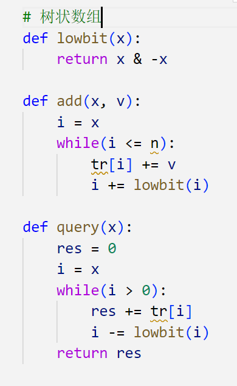
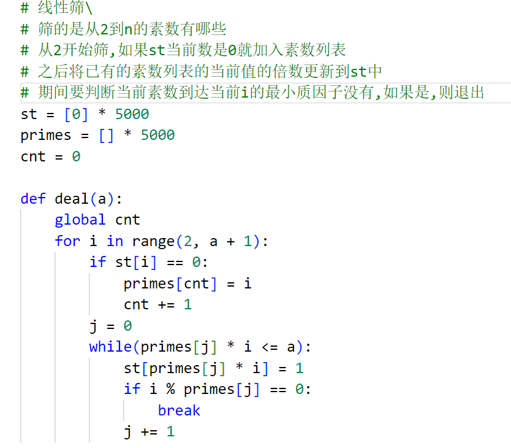

[蓝桥杯的备考在这里](#蓝桥杯python研究生组备考就是在这里了)  
[leetcode题目在这里](#leetcode题目)  
[算法笔记在这里](#一些算法笔记也在后面)  
[python有关的项目在这里]()

# 蓝桥杯python研究生组备考就是在这里了

<!-- [待学链接](https://www.bilibili.com/video/BV1qW4y1a7fU?p=72&vd_source=5a8651962259df7b14781b1d0370c6a0) -->

### 一些考试的注意事项
>>>**无巧不成题**

* 日期题是必考的.  
* dp状态转移方程要仔细分析,最好用递推的方式,不要用递归.  
* 可以根据数据规模分段处理,例如a∈[0, 1000]用solve1(),a∈[1001,100000]用solve().  
* python:对于多次输出,考虑答案拼接再统一输出,这是一个提升代码运行速度的技巧.   

* 看数据量可以大致猜出来这题的时间复杂度,也就可以大致选择出使用的算法.  

* 增加python的栈深度,默认是1000:   
```
import sys
sys.setrecursionlimit(100000)
```

* 开数组空间时,不要相c++一样定义一个最大N,可能会引发爆空间的问题,用输入的n来开空间,可以多开10个来保证边界问题

## 下面是经典的题目和代码  


<details><summary>SPFA：求有负权边的最短路径,维护一个dist数组,用了队列</summary>    

</details>

<details><summary>求一个数的约数的个数和约数之和</summary>    

</details>

<details><summary>DP的常规思路图</summary>    

</details>

<details><summary>树状数组</summary>    

</details>

<details><summary>线性筛</summary>    

</details>


## 下面是一些知识点  
* 数据类型转换:直接用int(), str(), float()  
* \+ \- \* \/ \% \//(整除) \**(次方) **eg. a //= 3**  
* 可以使用三引号注释 """中间可以包含多行内容"""   
* python里的print占位符:%s %d %f **eg. print("this is a sample %s and %d" % (one, two))**  
* 数据的精度控制:m.n **eg. print("number is %6.2d" % 23.231) -> out is []23.23**  
* 快速格式化:**print(f"this is a:{value_A}")**  
* python的输入是:**value = input()**,但是数据类型会一直是str
* 位置不定长: **eg. def test(\*args): 传入的参数不限制长度,用args保存,是一个列表**  
* 关键字不定长: **eg. def test(\*\*kwargs): 传入的参数不限制长度,但是要是键值对,用kwargs保存,是一个字典**  
* 函数也可以作为参数传入函数  
* \_\_name\_\_ == '\_\_main\_\_' 可以限制外部文件直接import导致的自动执行问题, \_\_all\_\_可以限制外部import *时所有方法被引入的问题**eg. \_\_all\_\_=['test_a']**  
* 创建一个数组:**list = [0 for i in range(10)]**  
* 把列表里面的元素一次性更改数据类型：**dist1 = list(map(int,dist))**    
* python对单一数组元素做循环且不能改变初始状态的操作时,需要另起一个变量,且不能简单使用赋值符:**eg a = [[1, 2, 3]] b = a[:]**  
* 二维数组切片:不能用p[:0][:0],要用**m = [row(:y) for row in g(:x)]**

# leetcode题目
### 文本左右对齐
```python
class Solution:
    def fullJustify(self, words: List[str], maxWidth: int) -> List[str]:
        res, line, str_num = [], [], 0
        for word in words:
            if str_num + len(line) - 1 + len(word) >= maxWidth: # 之前的单词组长度，单词间隔，新的单词长度
                for i in range(maxWidth - str_num):
                    line[i % max(len(line) - 1, 1)] += ' '
                res.append(''.join(line))
                line, str_num = [], 0
            line.append(word)
            str_num += len(word)
        return res + [' '.join(line).ljust(maxWidth)]
```

# 一些算法笔记也在后面
[数组和字符串](#数组和字符串)    
[双指针](#双指针真的很容易)  
[滑动窗口](#滑动窗口)  
[矩阵](#矩阵)  
[哈希表](#哈希表)  
[区间](#区间)  
[栈](#栈)  
[链表](#链表)    

## 数组和字符串

* 打印固定形状的字符,可以根据模拟的概念,在字符转弯处设置flag为-1或者1来控制字符加入行的方向.    
* python的hashmap的用法可以是**for key in hashmap**,用key来指引value.  
* python字典的get函数的用法,**get(key1, value1)**,如果key1不存在,则用value1作为get的返回值.  
* python的**enumerate**用法,可以把一个数组变换为下标和对应元素,具体可以这么用:**for key, value in enumerate(s)**.  
* python的**zip**函数和**set**函数,前者把多个数组的相同下标的元素打包在一起,组成一个新的数组,后者将一个数组中的重复元素去掉;额外的*str是把str数组解包,把里面的每个字符串作为独立的参数传递给调用者,用法:**zip(list), set(list)**.    
* python的**.sort**,原地的排序调用,使用方式是**nums.sort()**.  
* 一个计算的思想,左右规则分开做,用两个循环,在第二个循环里面合并答案.   
* 区间合并思想可以运用在最远跳跃的问题中.  
* python的**strip**函数可以去除字符串的前后空格  
* 取余符号可以很好地控制添加位置.  
* 使用快慢指针可以很好地控制筛选元素的效果.  
* python数组的切片[::-1]直接倒序所有元素.  
* 最大值问题,通常需要一个指针来指向最小值,并且需要不断更新.  
* 在总取值最大问题,需要把每一个上升段都考虑进去.  
* 在总体趋向正时,单点最小后面的趋向是上升.  
* python的**a.join(list)**的用法,a是一个代指,全意是list中的元素用a来做间隔组成一个新的list.  
* python的切片[-1]是倒数第一个,[-k]是倒数第k个.  
* 规则可以分左右,也可以分上下,比如上三角元素乘法和下三角元素乘法.  
* 二分的板子:**(l + r + 1) >> 1**,**l = mid**, **r = mid - 1**,yxc的板子,闭区间,一定会找到一个位置,循环体没有等于.闫学灿的板子就是垃圾,直接用,**循环有等于,不上去整,左右各偏移.**,另一个左闭右开的写法是:**循环体没有等于,l+1,r不变,也是没有上取整,另一个开区间的写法是,循环体l+1<r,l,r都不变返回r**    
* 字典和数组的结合,字典存数组的元素下标,可以利用两个数据类型的优点.  

## 双指针(真的很容易)
* 可以分左右两个指针,关键是固定好指针的移动规则.  
* 三个数的移动,可以先固定循环一个数,再加上l r的规则.  
* python的用法,**not**用在list前面可以是判断list是不是空,用法:**not nums**.  
* python的用法,**.isalnum()**,判断字符串是否由字母和数字组成,用法:**str.isalnum()**.  
* python的用法,**.lower()**,把大写转换成小写,用法:**str.lower()**,对应的是upper().  

## 滑动窗口
滑动窗口通常需要一个左右指针来控制窗口大小,指针可以是两端结构,也可以是一拖一结构.    
滑动窗口通常与字符哈希结合使用,与字典结合使用.  

* 一个技巧,在循环体里先判断后加值时,起始指针状态可以突破下限1,这样第一轮可以避开判断,直接进入加值,从而避免初始状态先行定义引发的多重判断和边界问题.  
* 一个很神奇的技巧,在两字符串对应规则匹配中,可以把tmp模版字符串整合成一个dic,用这个dic来代表代码级的规则,更方便匹配.  
* python的list变字典的用法:**cnt = {word : 0 for word in words}**.  
* python的拷贝,用法:**new_cnt = cnt.copy()**.  
* python的一个用法:把一个list里的元素变成一个dic:**cnt_s = Counter(list)**,包括了计数同时进行,但是需要导入**collections**模块(内置).  
* 一个需要注意的点,在先加下标后加下标对应的值时,需要考虑到下标值溢出的情况.  

## 矩阵
矩阵就是玩数组下标的东西  

* 要开标记空间,就是使用同样的空间大小来标记每个位置上的新状态,重点是那个下标转换公式.  
* 很多很无聊的找规律(下标向)题,就是看行列变换公式.  
* 一个点,python的浅拷贝和深拷贝,浅拷贝改变拷贝值,源也会改变,深拷贝则不会改源,使用方法是:**a.copy() 和copy.deepcopy()**,而且深拷贝需要导入copy模块.    
* 很多很无聊的控制边界的问题,比如控制向下边界的打印矩阵的特定形状.  
* python的数据类型set,它不会记录重复的元素.  
* 一个思路是说,把所有需要更改的行和列全部用一个set记录下来,这样再统一集中进行值的处理,就可以很大程度上节省时间空间开销和减少复杂度.  
* 矩阵的题就是很无聊,有时候需要一些遍历,就是跟暴力差不多,但是需要把状态找准了,某一个值代表一个状态,在最后状态合并的时候找准%n的n,来简化状态表示.  

## 哈希表
哈希表的整体思路就是开一个dict,然后查找,然后往里面加数,不同的是不同的题目有不同的查找规则,return规则,加数规则.  

* python的一个用法:查看字典的所有key和value,**dic.keys() and dic.values()**,注意,如果要显示出来需要加一个list转,如:**list(dic.values())**.    
* python的一个用法:开一个set类型的字典:**defaultdict(set)**.    
* list的查找是O(n)的,set的查找是O(1)的,所以在进行反复查找需要时,把list转成set会比较好.    
* 常用变量名里的值在做变换的时候需要注意存储,不要造成丢失,通常需要一个临时变量.  
* 在做映射关系的题目的时候,一定要注意映射关系,一般开两个映射字典.  
* 在O(n)的遍历和O(1)的查找,一般就是看一个元素放一个元素到dic,然后用set的in.  
* python的Counter函数,把一个list变成dict,索引是元素,键值是元素个数.  
* 还是说映射关系最好是搞一个双向的.  
* Counter出来的dict是可以比较的,比较符的含义是涵盖的意思.  

## 区间  
玩区间就是说要把还是需要很多对于初始值,数组下标的操作,需要细致,考虑情况,如果你不想debug的话.  
* 一个方法论,判断条件进入只需要精炼就可以,再在内部做取值操作.  
* 区间合并的问题很多,跟排序的往往配合使用,而且是单点排序,不同的是有时候需要左端点排序,有时候需要右端点排序.  
* 边界条件一定要看清楚,在取值赋值的时候,涉及到边界的问题要加一个if条件判断.  
* 最少数量拿到最多区间的问题用最右排序.  

## 栈
栈可以看做是递归的数据结构化

* 一个技巧,有对应关系首先就想到用字典,比如,x in xx, xx就是一个字典,在字典里设置好对应关系,再在条件判断里去进行赋值或者逻辑操作.  
* python的代码讲究的是一个精炼且浓缩.  
* **split(xx)** 函数把所有的xx都会去掉,并且如果有多个xx连续,那么在最终的list里会有一个""来占位.  
* 使用除法的时候,python的/是浮点除,//是向下取证除,而不是向0除,python里要用向0除,可以先浮点除,再转整数就可以实现向零除.  
* 一个辅助栈的思维:在记录一个数的时候,再多开一维,就是说记录(num, moredimension),这个维度可以表示当前所有数里的最值或者其他含义.  
* 一个很神奇的逻辑:在遇到运算符的时候,把当前积累的数转换成一个常用变量的存值.  

**栈真的没有什么东西,主要是逻辑关系,包括这个逻辑关系在任何的代码实现中都是十足重要的.**

## 链表
链表就好像一团有各种连接线的灯泡,妈的逻辑真难.  

* 链表跟递归搞到一起,就很复杂,递归的基础,设置出口,在链表的实现上,通常是线性的.  
* 合并两个链表的神级操作,递归里面对单独的节点进行操作,具体是用递归的方式拼接后面的节点,然后把这个节点返回给上一层递归,太特么吊了.  
* 链表思路:可以搞一个哨兵节点放在头结点的前面,这样可以避免头结点边界的问题,然后可以把中间的操作节点单独出来,最后做链表的拼接就碉堡了.  
* hash表模拟链表也碉堡了,用节点做key,用创建的新节点盛放之前的节点的各项属性,又是一个碉堡了的思路.  
* dict的python用法,获得value也可以用:**dict.get(key).**  
* 指针的题目，画个图是最好的.  
* 用哨兵节点可以大大减少逻辑量.  
* 指针的定义可以是在while循环里看当前的下一个和当前的下下个.  
* 旋转链表可以结合双指针来建立逻辑,也是段落重新连接和结果组合.  
* 涉及到分割,可以开两个辅助链表,同时每个链表配备一个辅助指针来添加节点,最后把两个辅助链表结合起来.  
* LRU缓存, 字节和华为的面试题,没的说,强的一批.  

```
华为 字节笔试题  
一个python的点，__slot__ 变量可以阻止实例化类的时候为实力分配__dict__，这里面声明的变量变成了类的描述符，相当于c++的成员变量声明。  
该实例只能有slots中定义的变量，且不能再增加新的变量。定义了slot就不能再有dict  

这是一个字典和实际链表节点分离的思想，虽然里面存放的值都是一样的，节点也是同样的节点，可以说是一个元素体现在了两个数据结构上。
```

```python
class Node:
    __slot__ = 'prev', 'next', 'key', 'value'

    def __init__(self, value = 0, key = 0):
        self.value = value
        self.key = key

class LRUCache:

    def __init__(self, capacity: int):
        self.capacity = capacity
        self.key_to_node = dict()
        self.dummy = Node()
        self.dummy.next = self.dummy
        self.dummy.pre = self.dummy

    def get_node(self, key: int) -> Optional[Node]:
        if key not in self.key_to_node:
            return None
        node = self.key_to_node[key]
        self.remove(node)
        self.put_front(node)
        return node

    def get(self, key: int) -> int:
        node = self.get_node(key)
        return node.value if node else -1

    def put(self, key: int, value: int) -> None:
        node = self.get_node(key)
        if node:
            node.value = value
            return 
        self.key_to_node[key] = node = Node(value, key)
        self.put_front(node)
        if len(self.key_to_node) > self.capacity:
            delnode = self.dummy.prev
            del self.key_to_node[delnode.key]
            self.remove(delnode)
        
    def remove(self, node : Node):
        node.prev.next = node.next
        node.next.prev = node.prev

    def put_front(self, node : Node):
        node.next = self.dummy.next
        node.prev = self.dummy
        self.dummy.next.prev = node
        self.dummy.next = node
```

## 二叉树

* 一个递归的简单逻辑:if xx if xx return xx.  
* 一个python的写法,在def里面定义def,但通常需要nonlocal来声明使用外部变量.  
* 深搜,用递归来实现是很正常的事情.  
* 一个找前缀数组中,右节点公式的问题:左子树的根节点在前缀中直接就是下一个元素,右子树的根节点是父节点位置 + 左子树数量的后一个.  
* 在后缀数组里找也是这个公式的思路.   
* 一个python的写法:if xx return xx==xx.  
* 判断当前节点是不是叶子结点:判断它的左右是不是空.  
* 一个神奇的二叉树拉直的思路:左子树变成右子树,右子树放到最下边.   
* 一个很神奇的思路:把第一次深搜出来的节点作为pre数组,这样可以拿到一边看的第一个节点,实际实现是 depth == len(pre).  
* 递归的神奇用法:找二叉树中的最大路径和,遍历每一个节点和他的左右子链来看这条路径是不是最大的.  
* 找下一个节点,就是说直接在二叉树里找到前序遍历的下一个节点,就是一个单调栈的问题,只需要把它所有的左节点入栈就可以.  
* 看节点个数,遍历一遍就行.  
* 翻转二叉树,很简单,把左变右,右变左,用递归实现.  
* 二叉树的最近公共祖先,神奇的思路,在递归里面,返回值只能是所需节点和空,跳出条件就是当左右节点都不空,那么返回值就是所需的两个节点,最终的返回值就是最近的公共节点.  


## 二叉树层次遍历

* python的一个写法,deque的popleft, popright的复杂度是O(1),而queue的pop(0)是O(n)的.  
* 双端队列的运用可以简化时间复杂度.  
* 看右视图,只需要递归的时候先遍历右边再遍历左边就可以.  
* 所有的层序遍历都可以用宽搜来实现.  

## 二叉搜索树 

这里就几个知识点:前缀遍历,中缀遍历,后缀遍历  

* 在用中缀遍历判断数的合法性的时候,需要用一个变量存储前一个节点,因为,前一个节点在空间上不连续.  
* 有一种递归不返回值,有一种递归一直返回值.  
* 不返回值就直接在函数里更改全局变量,一直返回值就用yield生成器,这里有一个python的用法:yield from dfs(), yield num.  

## 图

图也就是玩下标,无聊的很.  

* 一个拷贝图的思想:拼多多的面试题:  
```python
from typing import Optional
class Solution:
    def cloneGraph(self, node: Optional['Node']) -> Optional['Node']:
        lookup = {}
        def dfs(node):
            if not node:
                return
            if node in lookup:
                return lookup[node]
            clone = Node(node.val, [])
            lookup[node] = clone
            for n in node.neighbors:
                clone.neighbors.append(dfs(n)) # 这里是因为n这个节点可能还没有被创建出来
            return clone
        return dfs(node)
```
* 岛屿的数量有一个错误点:在dfs里用灌水算法,要用局部变量存放临时的xy 偏移值.  
* 判断有无环,就用拓扑图的思想,用队列,用入度来加入队列.  
* 有些情况需要自己抽象题目内容来构造图,方法是如果a能转移到b,那就给a到b加一条边.  

## 图的广度优先搜索

* 一个python的用法:combinations,用来将列表里的值按照给的num数量配对,用法:**for a, b in combinations(list + [nums], 2).**  

# python项目

[mysql密码忘记了看这里重置密码](https://zhuanlan.zhihu.com/p/561515580)

## 有关的一些命令
* **netstat -ano|findstr 8000**:windows查看端口占用情况。  
* **tasklist|findstr 8000**：windows查看端口被什么占用。  
* **python manage.py startapp xxx**:django新建一个app。   