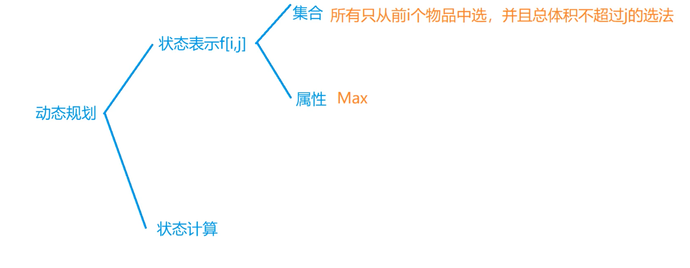

[蓝桥杯的备考在这里](#蓝桥杯python研究生组备考就是在这里了)  
[leetcode题目在这里](#leetcode题目)  
[算法笔记在这里](#一些算法笔记也在后面)  

# 蓝桥杯python研究生组备考就是在这里了

<!-- [待学链接](https://www.bilibili.com/video/BV1qW4y1a7fU?p=72&vd_source=5a8651962259df7b14781b1d0370c6a0) -->

### 一些考试的注意事项
>>>**无巧不成题**

* 日期题是必考的.  
* dp状态转移方程要仔细分析,最好用递推的方式,不要用递归.  
* 可以根据数据规模分段处理,例如a∈[0, 1000]用solve1(),a∈[1001,100000]用solve().  
* python:对于多次输出,考虑答案拼接再统一输出,这是一个提升代码运行速度的技巧.   

* 看数据量可以大致猜出来这题的时间复杂度,也就可以大致选择出使用的算法.  

* 增加python的栈深度,默认是1000:   
```
import sys
sys.setrecursionlimit(100000)
```

* 开数组空间时,不要相c++一样定义一个最大N,可能会引发爆空间的问题,用输入的n来开空间,可以多开10个来保证边界问题

## 下面是经典的题目和代码  


<details><summary>SPFA：求有负权边的最短路径,维护一个dist数组,用了队列</summary>    

</details>

<details><summary>求一个数的约数的个数和约数之和</summary>    

</details>

<details><summary>DP的常规思路图</summary>    

</details>

<details><summary>树状数组</summary>    

</details>

<details><summary>线性筛</summary>    

</details>


## 下面是一些知识点  
* 数据类型转换:直接用int(), str(), float()  
* \+ \- \* \/ \% \//(整除) \**(次方) **eg. a //= 3**  
* 可以使用三引号注释 """中间可以包含多行内容"""   
* python里的print占位符:%s %d %f **eg. print("this is a sample %s and %d" % (one, two))**  
* 数据的精度控制:m.n **eg. print("number is %6.2d" % 23.231) -> out is []23.23**  
* 快速格式化:**print(f"this is a:{value_A}")**  
* python的输入是:**value = input()**,但是数据类型会一直是str
* 位置不定长: **eg. def test(\*args): 传入的参数不限制长度,用args保存,是一个列表**  
* 关键字不定长: **eg. def test(\*\*kwargs): 传入的参数不限制长度,但是要是键值对,用kwargs保存,是一个字典**  
* 函数也可以作为参数传入函数  
* \_\_name\_\_ == '\_\_main\_\_' 可以限制外部文件直接import导致的自动执行问题, \_\_all\_\_可以限制外部import *时所有方法被引入的问题**eg. \_\_all\_\_=['test_a']**  
* 创建一个数组:**list = [0 for i in range(10)]**  
* 把列表里面的元素一次性更改数据类型：**dist1 = list(map(int,dist))**    
* python对单一数组元素做循环且不能改变初始状态的操作时,需要另起一个变量,且不能简单使用赋值符:**eg a = [[1, 2, 3]] b = a[:]**  
* 二维数组切片:不能用p[:0][:0],要用**m = [row(:y) for row in g(:x)]**

# leetcode题目
### 文本左右对齐
```
class Solution:
    def fullJustify(self, words: List[str], maxWidth: int) -> List[str]:
        res, line, str_num = [], [], 0
        for word in words:
            if str_num + len(line) - 1 + len(word) >= maxWidth: # 之前的单词组长度，单词间隔，新的单词长度
                for i in range(maxWidth - str_num):
                    line[i % max(len(line) - 1, 1)] += ' '
                res.append(''.join(line))
                line, str_num = [], 0
            line.append(word)
            str_num += len(word)
        return res + [' '.join(line).ljust(maxWidth)]
```

# 一些算法笔记也在后面
[数组和字符串](#数组和字符串)    
[双指针](#双指针真的很容易)
## 数组和字符串

* 打印固定形状的字符,可以根据模拟的概念,在字符转弯处设置flag为-1或者1来控制字符加入行的方向.    
* python的hashmap的用法可以是**for key in hashmap**,用key来指引value.  
* python字典的get函数的用法,**get(key1, value1)**,如果key1不存在,则用value1作为get的返回值.  
* python的**enumerate**用法,可以把一个数组变换为下标和对应元素,具体可以这么用:**for key, value in enumerate(s)**.  
* python的**zip**函数和**set**函数,前者把多个数组的相同下标的元素打包在一起,组成一个新的数组,后者将一个数组中的重复元素去掉;额外的*str是把str数组解包,把里面的每个字符串作为独立的参数传递给调用者,用法:**zip(list), set(list)**.    
* python的**.sort**,原地的排序调用,使用方式是**nums.sort()**.  
* 一个计算的思想,左右规则分开做,用两个循环,在第二个循环里面合并答案.   
* 区间合并思想可以运用在最远跳跃的问题中.  
* python的**strip**函数可以去除字符串的前后空格  
* 取余符号可以很好地控制添加位置.  
* 使用快慢指针可以很好地控制筛选元素的效果.  
* python数组的切片[::-1]直接倒序所有元素.  
* 最大值问题,通常需要一个指针来指向最小值,并且需要不断更新.  
* 在总取值最大问题,需要把每一个上升段都考虑进去.  
* 在总体趋向正时,单点最小后面的趋向是上升.  
* python的**a.join(list)**的用法,a是一个代指,全意是list中的元素用a来做间隔组成一个新的list.  
* python的切片[-1]是倒数第一个,[-k]是倒数第k个.  
* 规则可以分左右,也可以分上下,比如上三角元素乘法和下三角元素乘法.  
* 二分的板子:**(l + r + 1) >> 1**,**l = mid**, **r = mid - 1**.  
* 字典和数组的结合,字典存数组的元素下标,可以利用两个数据类型的优点.  

## 双指针(真的很容易)
* 可以分左右两个指针,关键是固定好指针的移动规则.  
* 三个数的移动,可以先固定循环一个数,再加上l r的规则.  
* python的用法,**not**用在list前面可以是判断list是不是空,用法:**not nums**.  
* python的用法,**.isalnum()**,判断字符串是否由字母和数字组成,用法:**str.isalnum()**.  
* python的用法,**.lower()**,把大写转换成小写,用法:**str.lower()**,对应的是upper().  

## 滑动窗口
滑动窗口通常需要一个左右指针来控制窗口大小,指针可以是两端结构,也可以是一拖一结构.    
滑动窗口通常与字符哈希结合使用,与字典结合使用.  

* 一个技巧,在循环体里先判断后加值时,起始指针状态可以突破下限1,这样第一轮可以避开判断,直接进入加值,从而避免初始状态先行定义引发的多重判断和边界问题.  
* 一个很神奇的技巧,在两字符串对应规则匹配中,可以把tmp模版字符串整合成一个dic,用这个dic来代表代码级的规则,更方便匹配.  
* python的list变字典的用法:**cnt = {word : 0 for word in words}**.  
* python的拷贝,用法:**new_cnt = cnt.copy()**.  
* python的一个用法:把一个list里的元素变成一个dic:**cnt_s = Counter(list)**,包括了计数同时进行,但是需要导入**collections**模块(内置).  
* 一个需要注意的点,在先加下标后加下标对应的值时,需要考虑到下标值溢出的情况.  