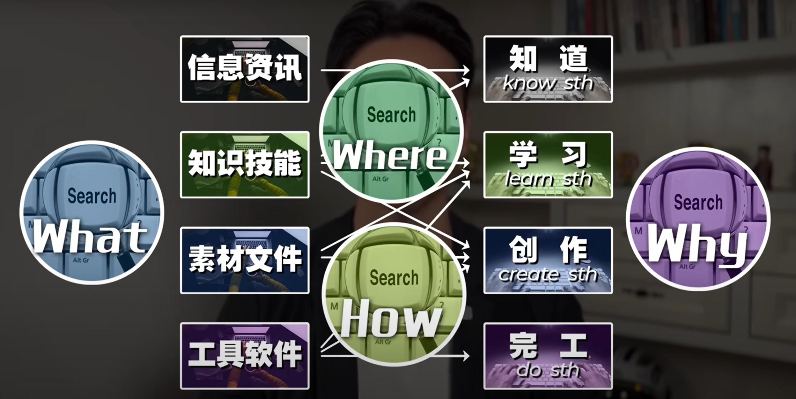
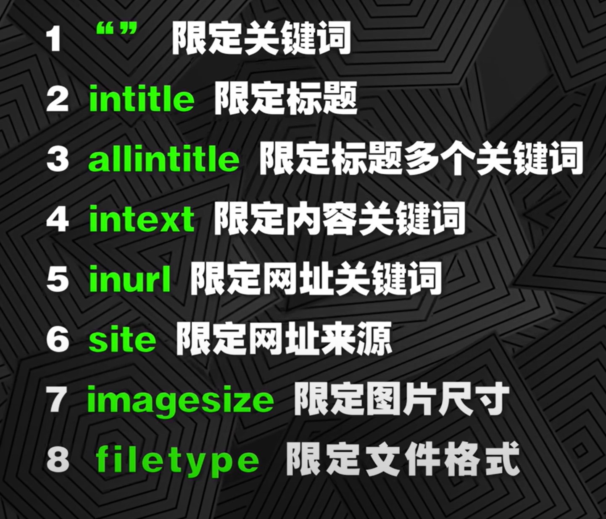
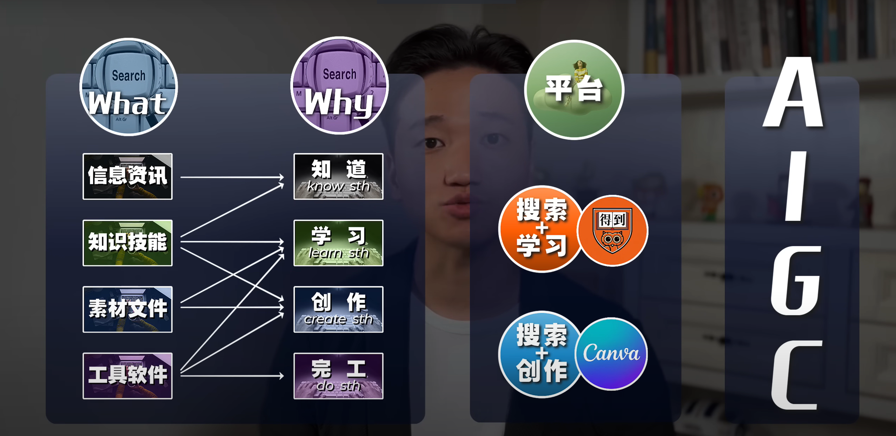

# 搜索技术是普通人变强的唯一外挂

[视频链接-来源youtube](https://youtu.be/tiN6T1LewmQ?list=LL)

```
--2023/11/06
```

### 搜索时要明白的四个问题:why what where how
  

> **什么搜,搜什么,到哪搜,怎么搜**

#### 搜索效率:
> 谷歌 > 公众号 > 短视频 > 百度  

#### 搜索技巧(可以组合使用)  
* 限定搜索:加英文双引号,例如限定搜索林俊觉  
```
"林俊觉"
```

* 标题关键字搜索:加**intitle:**,例如搜索芭乐情歌过时了  
```
intitle:芭乐情歌过时了
``` 

* 标题多关键字搜索:加**allintitle:**,例如搜索标题里有林俊杰和情歌  
```
allintitle:林俊杰 情歌
```

* 内容关键字搜索:加**intext**,例如搜索文章内容有林俊杰跑调  
```
intext:林俊杰跑调
```

* 网址关键字搜索:加**inurl**, 例如在youtube上搜索林俊杰跑调  
```
intext:林俊杰跑调 inurl:youtube 
```

* 限定内容来源网站:加**site:xxx.com**,即site:后加上完整的域名  
```
intext:林俊杰豆浆油条 site:youtube.com
```

* 限定图片尺寸:加**imagesize:**,例如搜索林俊杰图片3840x2160的图片  
```
林俊杰 imagesize:3840x2160
```  

* 限定文件格式:加**filetype:**,例如搜索母婴行业2023的研究报告  
```
母婴行业2023 filetype:pdf
```



### 如果你的内容主要承载在网页上:  
> 去[google](https://www.google.com/?hl=zh_CN)
> [搜狗](https://www.sogou.com/)搜索 
> 微信搜一搜
> 垂类社群
> 聚合网址找(如[程序员导航](http://www.cxysite.com/))

### 如果你的内容主要承载在文档上:  
> 使用google的搜索语法:filetype,限定pdf
> inurl搜索,限定报告网站域名  
> 去找类似的网站,用[similarsites](https://cn.similarsites.com/)查, 可以快速聚合头部网站

### 如果你的内容主要承载在论文上:
> 使用[谷歌学术](https://scholar.google.com/schhp?hl=zh-CN&as_sdt=0,5)
> 使用[sci-hub](https://sci-hub.se/)  

### 如果你的内容主要承载在电子书上:
> 使用[鸠摩搜书](https://www.jiumodiary.com/)  
> 英文的用google搜索best free ebook download sites, 找网站,一般用[z-lib](https://z-lib.is/) [manybooks](https://manybooks.net/) [pdfbooksworld](https://www.pdfbooksworld.com/)  


# 不懂就问是小孩子,成年人不懂就搜  
### 一些tip
* youtube的视频在网址**www.**后面加**9x**就可以直接下载.  

* 全网通杀的下载网站:[save.tube](https://save.tube/en35/)  

* 有版权的图片网站:[gettyimages](https://www.gettyimages.com/)  

* ppt模版在线网站:[canva](https://www.canva.com/) 

* 寻找软件的替代软甲:[alternativeto](https://alternativeto.net/)

#### 使用工具的顺序是:
**在线工具 -> 软件 -> 插件**  
**google强大公式: xxx需求 + online**
## google的最强搜索公式:
**best sites for /free loyalty video/free gif/free bgm**  

## 搜索心法: 内事不决搜微信,外事不决问谷歌


> 神功已成