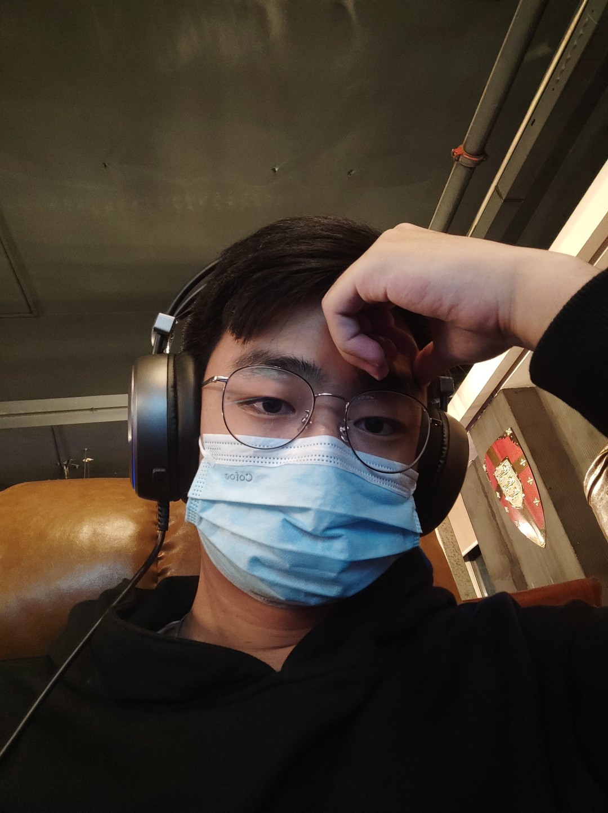
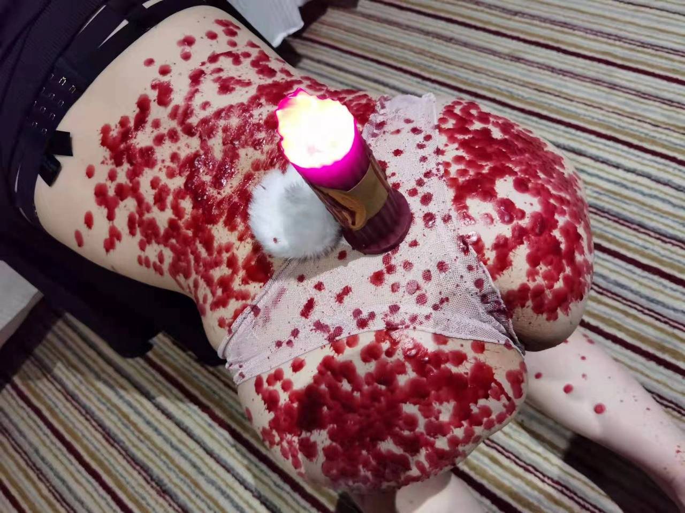
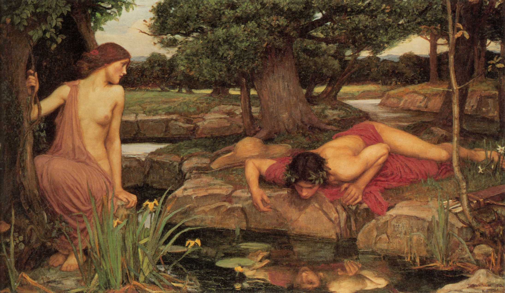

# 为你开放的另一个世界

```
--begin at 2023/12/23
```  
## 哥们看着你看



<details><summary>字母圈的那些事</summary>    
<a href="https://www.bilibili.com/video/BV1ba4y1U7Ls/?spm_id_from=333.999.0.0&vd_source=5a8651962259df7b14781b1d0370c6a0">啥是BDSM</a>  

</details>

<details><summary>水仙->自己的人格完善之路</summary>    
<a href="https://www.bilibili.com/video/BV11G411S75k/?spm_id_from=333.337.search-card.all.click&vd_source=5a8651962259df7b14781b1d0370c6a0">啥是水仙(自性恋)</a> 

<center>《厄科与那耳喀索斯》</center>  
根据神话，<b>那耳喀索斯（希腊语：Νάρκισσος，直译为“水仙”）</b>是河神刻菲索斯与水泽神女利里俄珀之子。那耳喀索斯出生后，利里俄珀向著名的预言家提瑞西阿斯询问自己儿子的命运。提瑞西阿斯说，那耳喀索斯只要不看到自己的脸，就能得长寿。因此，尽管那耳喀索斯长大后成为全希腊最俊美的男子，他却从不知道自己长什么样子。

那耳喀索斯的美貌让全希腊的女性为之倾倒，但他对所有前来求爱的女人都无动于衷。后来掌管赫利孔山的仙女厄科也被他的美貌迷住，陷入对他的爱情无法自拔。那耳喀索斯对厄科的求爱也同样加以拒绝，导致厄科伤心而死，只留下声音回荡在山谷之间（厄科的名字Ἠχώ意为回声）。被他拒绝的女子们都要求复仇女神涅墨西斯惩罚那耳喀索斯。涅墨西斯同意了她们的请求。一次那耳喀索斯打猎归来时，在池水中看见了自己俊美的脸。他于是爱上了自己的倒影，无法从池塘边离开，终于憔悴而死。这样就实现了提瑞西阿斯在他幼年时所作出的预言。在那耳喀索斯死去的地方生出了一株水仙花。
</details>