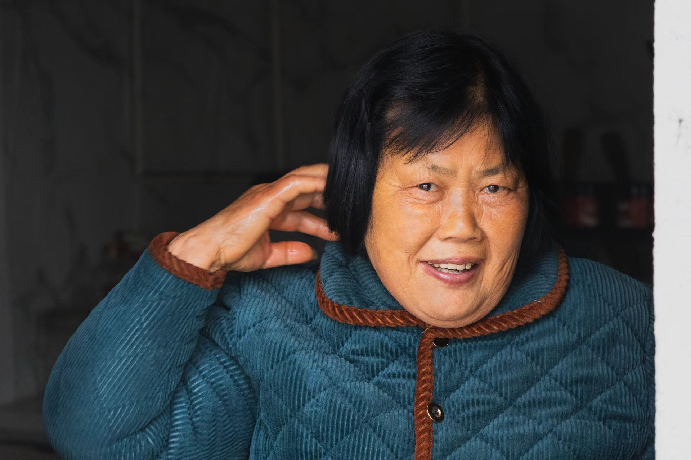

# 在原有价值框架上总结出来的真理往往都是偏见的巩固与延伸,写出来或许能审视清楚

[貌美不如玲珑心,贤妻扶我青云志,郎俊不如志高远,我与贤夫登云梯](#人都说贤妻扶我青云志对于爷爷来说是没有的对他来说更是没有的)  
[其实我想要,一种美梦睡不着](#其实我想要一种美梦睡不着)  
[不愿孤独的人是不愿面对自己的人](#不愿孤独的人是不愿面对自己的人)

### 近24年的历程总结   
在这一刻,我不知道自己该往哪里走,心里总想要一个方向,于是寄希望于梳理过去,找到自己一直在以什么为方向前进,警醒自己.  
在于往常,我会给奶奶打电话,她会为我解答疑惑的,现在,我想自己为自己解惑.  
从我有记忆起,我是在老家菜园子里站着的,那是我人生的第一个画面,印象里对于年龄是有一个数字的,大概是三岁,那个时候爷爷奶奶身体非常硬朗,最开心的事情是吃西瓜和甘蔗.后来的一幕是第一次吃炸鸡,是一家不知道开在什么地方的不知名的炸鸡店,跟爸爸妈妈一起,过程里充满了疑惑,这个疑惑是对于他们的,因为当时是有焦虑气氛的.好像是在同一个地方,我看到了一个鳄鱼头,或许有身体,被当做药在售卖,还有一幕是与手机有关,发现了手机有各种铃声可以听,记得当时很开心.以前的回家的路是没有水泥的,全部都是泥巴路,记忆力有外婆,有妈妈,在送别我,外婆在哭,妈妈希望我亲她一下,我没有很愿意,因为好像要对着嘴亲,但是奶奶在旁边让我亲上去,我照做了.好像是从那个时候起,我的人生被奶奶支撑起来了.这些记忆是是什么时候产生的,无法知道了...  
学前班的时候,我已经从石首回来了,可能是没有办法在石首正常上一年级,我回团山小学读了一个学前班和一年级,印象最深刻的是,当时一个班竟然有六十多个人,我在教室的考中间的左边坐了一个座位,桌子就是那种还挺平整的棕色木头桌子,那是我第一次接受知识,也是我人生第一次思考:这个大于小于到底要怎么分清呢,哈哈哈,想起来也是蛮有意思的,我记得当时用了开口大小来记,小的数字用尖尖对着,可是真要去看两个数的时候,就有点认不清符号了.我没有在那个教室过很久的时间,但是有一个事情让我记得很深,学校放假,因为是过节,过了周末还有一天是假期,可是我忘记了,那天早上,爷爷带我去上学,到了校门口一个人也没有,我怕是已经上课了,爷爷也担心,于是我赶紧进了教室,一个人也没有,当时我有点害怕,手里攥着爷爷给我的绿豆糕,躲在课桌地下吃,也不知道吃完没有,就回去了,回去的路上下了大于,我是背着书包淋回去的,但是我一点也不担心,也不害怕,只知道回去就好了,但是路边有个不知道谁家里的认识我的妇人,叫我,问我是不是谁家里的孩子,让我快点回去,我好像说的是我刚上完学,我回去了.我一点也不害怕,回家了爷爷奶奶问我怎么回来了,那个时候我才记起来,好像学校今天是放假.奶奶就开始骂爷爷,那也是我印象里记得的第一次奶奶骂爷爷.我在学校的操场里摔过屁股,那是有一次刚下过雨,操场里都是积水,周围被红绳子围起来了,同学们有的佝着进去玩,我也想,可是地上有点滑,屁股上摔得都是泥巴和水.那段时间最快乐的就是在操场上抓毒母子,那到底是什么小虫子呢,我好想也不太记得了.但是我在那里也是有引以为傲的经历的,学校要举办一个文艺汇演,我们班要出一个节目,我是其中一员,当时排练可以用上课的时间,那个时候练习可是能够看电视的,电视里的人做什么动作,我们就做什么动作,也要买小军装,还有帽子的,而且,也去屋子里排练,就是说进屋子里了就完全找不到之前的前后左右的人在哪里了,遗憾的是最后老师通知上台表演的机会没有了.但是我还是穿着服装看了演出,文艺汇演开始的时候,奶奶告诉我放了一瓶饮料在老师那里,我记得当时在看台上的人表演,一直到快结束的时候才找了老师要,拿到之后喝得很快,喝完好像也开心起来了.  
后来我去了石首,之后的很长一段时间,我的人生里只有两个人,奶奶和姐姐,经历最多的事情是搬家,可我仍然很安心,因为所有事情奶奶都会做好,她给我的任务从来只有一个,那就是好好在学校学习.有奶奶在的日子总是让我很安心,找不到奶奶我会想她不是走去哪里把我忘掉了,但是我也不害怕,因为我会去找她.第一件事情是奶奶带我去找小学里的校长,问问我上学的事情怎么办,只记得当时奶奶是在恳求她,也记得当时她没有给肯定的答复.回去的路上我好像也没有很开心,因为奶奶没有很开心,也因为我好像要去一个我不熟悉的地方了.后来我考了一次试,我还记得当时的卷子上有一道题,要写出来声母韵母有哪些,我不会做,也可能我学过但是我忘记了.后来我入学了,小学5班.有一天早上,我跟奶奶说,我不要你送了,我可以自己上学,于是我自己背了书包,自己上学了,即使是很窄的门檐,我也要走,因为奶奶说不要走马路边上,很危险,当时我知道奶奶在后面跟着,不是很高兴,因为奶奶答应我了让我一个人上学.我没有告诉奶奶一个秘密,为什么我的数学成绩突然会变好呢,因为那个新老师跟奶奶很像,我愿意听她的课,也愿意听她讲的东西.姐姐不是很听奶奶的话,奶奶告诉过我一个秘密,她为了让姐姐不看那些小说,去掀了小卖部老板的摊子.因为姐姐心里有更多没有办法言说的问题,所以奶奶说的话她不是都听得进去,我很心疼姐姐.姐姐的字写得很好看,她给我抄的歌词是我见过的最好看的歌词.我人生第一次看到韩剧是用姐姐的MP4,我人生第一次感受到音乐的辽阔感是那首下雨的垦丁.可是姐姐好像不总是开心的,尤其是在她高考的第二天的中午饭的桌上,可能是那天饭桌上有她不熟悉的姑妈.如果是我,我的妈妈和爸爸突然回来了,我应该会疑惑,而不是开心.因为当时奶奶问了姐姐,你怎么不开心呢,而姐姐没有回答.后来姐姐去读大学了,家里只有我和奶奶了.这之后,奶奶就是我的全部,我不能让奶奶生气,因为她一生气就会捂住胸口,她很疼的样子,我不能不接奶奶递给我的电话,因为她会催我快点接,我也不能不说话,因为不说话跟没接没有区别.除此之外我好想就没有什么不能做的了,我可以把我们俩都锁在楼顶,关上一早上,我可以晚点去学校,奶奶会帮我跟老师请假,我可以在学校里就吃到家里的饭,因为奶奶会把饭送过来,我可以周末去舅爷那里玩电脑,因为那是奶奶的哥哥,我可以挑菜不好吃,虽然说会让奶奶失望就是了.对了,还有一个不能做的,就是把手伸到奶奶脖子里,哈哈哈,每次这样做她就会打我的手.有时候我也挺害怕她的,奶奶不能坐长途车,会有很严重的晕车反应,每次学校放长假是我最害怕的时候,因为从石首回团山要坐快两个小时的客车,到家奶奶要睡觉,有一次到家已经要天黑了,我叫奶奶起来,奶奶说她要睡一会,我走开了,天黑了的时候,我站在房门前面看奶奶睡觉的床,很黑,只能看到床上有一个隆起,我很怕黑,我去床边上,我喊奶奶,她答应我了,我就不害怕了.有时候我也对她不开心,奶奶总会在学校有儿童节的时候给我准备吃的,有一次学校给我们发了糖果,同学都吃掉了,可我想带回去给奶奶吃,可是回去了她不在,我坐在窗户旁边其实挺不开心的.我喜欢被奶奶抱着的感觉,不管发生任何事,只要奶奶抱我了,就没事了.
等到上了高中,奶奶不用再把我带在身边了,奶奶回了老家,寄宿的高中,奶奶说要我自己过独立生活了.我想什么是独立生活呢.我说话有时候挺伤人的,不然不会在奶奶来学校看我的时候,说:你怎么来了.我到现在还记得她错愕的样子,那一次我真的伤到她的心了.后来老家只有奶奶一个人在,有一段时间学校放双休,每次回去看到奶奶迎接的样子我是真的很开心,等到走的时候,我是真的很难受,傍晚,我能做的只有把门前扫干净,然后说一声我扫完了,我要走了.高中其实是没有好好学习的,谁知道呢,但是奶奶还是很支持,我说宿舍住不好,奶奶就联系了学校的熟人给我找了一个寄宿,那个房间真的很贵,我第一次那么真实地感觉到奶奶的压力和无奈,她也知道很贵,但是我提了,奶奶就办,我难受的是,最后竟然要奶奶安慰我没事,去住吧.好像就是从高三开始,我的人生里开始有了第三个人,爸爸,我到现在不愿意叫他这个称呼,我的心告诉我,他没有赢得我的认可,但是奶奶叫我要叫他,我这样做了.我没有这个底气,让奶奶不再难受,不再接受那些给奶奶带来气愤的人,甚至我不明白为什么奶奶会一边生气一边承受,甚至说那些可以称为妥协的事情要发生在奶奶身上,我想要保护她,可是正是带给他伤心的人是她要保护的人,我应该怎么办呢.
上了大学,奶奶好像没有那么亲我了,每次回去看她的眼神总是要打量我一下,说话好像也生疏了很多,奶奶说的最多的话就是:都比我高出这么多了.我不喜欢她这样子,我想她和以前一样.但是,她会和我一起喝酒了,她会告诉我她年轻时候的事情,他会教我怎么在起矛盾的时候斩钉截铁地办事,又留情面地对人.这期间,我们谈论最多的是家里的问题,爸爸再婚的对象如何不妥,但是大多时候是我先提出的,因为我不提不舒服.她也会说她的难受,如果她年轻的时候去了粮食站的食堂当炒菜师傅,如果当时能够买上保险,现在也是拿着退休工资的人了,然后骂骂爷爷当时怎么怎么不支持她,又是怎么怎么不管家里的孩子.我很乐意听她讲这些事情,因为我想她说出来会开心,我想她开心.后来,我颓废了,现实的困境把我压住了,我开始一整天躺在床上,不吃不喝.还是奶奶,她把我从床上拉起来,问我要吃什么,她去做,那个时候,我真的像看到了希望一样,我的手臂感受到一种力量,我明白了还有一个人是希望我站起来的,奶奶能够承受巨大的压力的情况下,分给我勇气,我不知道该用什么语言来形容我现在的心情,只知道眼睛里的眼泪涌出来了.后来,我去完成了她期望的事情,我不能辜负奶奶,我要证明,我也能像她一样承担所有事.  
后来我问她,你这一辈子有什么遗憾没做的事情吗,她回答我说:我这一辈子做的事情够多了.  
**2024年8月12日,22:32:39**  

### 不愿孤独的人是不愿面对自己的人
我有很多如果的想法，如果有的事情没有发生，如果没有面临那么多困惑的问题，如果我是能开口问的性格，如果那些事情没有在我生命里发生，那么我现在会是什么样子呢，我好希望那么多事情没有发生过，我好希望这一切都是一场梦，我好希望把这一切都重新来过，我要重新活一个我，很多事情摆在我面前，没有办法解决的，都是我阻挡我的坎，十三岁被拦住了，十七岁被拦住了，浪费了很多时间，二十一岁没有被拦住，二十一岁的我放过了那些问题，跳过了那些问题，搁置了那些问题，二十三岁开始决心往前走，还有留念，留念十三岁的我，可惜十七岁的我，我应该孤独一人，我应该把一切都忘掉，我应该往前走，当初那个炽热的我，如果能少一些迷惑，不要经历那么多困惑，现在的我会是什么样的呢。很难过，我很累，我想回去，可是要怎么回去呢，回不去了。。。

**-- 2024年8月3日,1:56:39**

### 其实我想要,一种美梦睡不着

其实我想要，一种美梦睡不着，一种心脏的狂跳.  
"一种"带有特指的意思，表达限定的含义，是对某件事物的限制和要求，有独特的审视和权衡。  
"美梦"带有极强的主观感受，什么样的梦可以称为美，这样的美附加在梦上会是什么样子，这都取决于"我"这一个体。  
"睡不着"是一个结果，是一个状态，是什么产生了这个状态，是因为外力导致的没有睡着的条件，还是因为内力自己不愿意睡还是不可以睡。  
解读：这在讲一种感觉：我做过一个梦，我很喜欢这个梦，我非常向往这个梦境，但又因为太喜欢，一想到这个梦发生过又会激动得（心脏的狂跳）睡不着觉，是一种理想主义者获得了百分之两百的满足之后的感觉，一种在现实中强烈地感受到活着的感觉。

**-- 2023年10月12日,1:18:39**

### 人都说贤妻扶我青云志,对于爷爷来说,是没有的,对他来说,更是没有的.

爷爷有六个兄弟,我常常想为什么只有爷爷的儿女全都离了婚,我试图探究以前发生的事,试图找到一个合理的解释,以此让渴求家庭温暖的我心安.一开始我是询问奶奶,可每次提起离婚的原因时得到的线索总是妈妈的不对,我觉得这是片面的,因为当时我提出问题之前已经能感受到离婚的结果并不是妈妈一个人的原因,或许跟其他人有关,于是我在某一年过年的时候去了妈妈那边了解情况,得到的回答让我十分吃惊,也难以接受,但在此刻写下这段文字的时候,一切也都显得合理.

先说说最近几年,这几年我跟爸爸(以下通称他)的关系很僵硬,这中间发生的事情让我对他已经绝望.人前装模作样,人后唯唯诺诺,懦弱无为,我的信仰来自:即使懂得再便于操控人性的方法,也不应该用在家人身上,来伤害家人;可他总是用掩盖问题的方式来处理问题,其中夹带着对有心人的嘲讽和蔑视,也曾经就事论事地想要让他意识到他这种方式并不会让人很舒服,可每次交流得到的结果往往浮于表面,得到的回应也只是对于事情本身而言的一句'没办法',渐渐地也就没有办法再继续交流下去了.

在我的印象里奶奶是这个家里最有能力的人,她造就了这个家在自己的儿子没有妻子的情况下也能向前发展,但也是她的'能力'造就了这个家注定不会有第二个女人的存在.毫无克制地介入后辈的生活,掠夺式地侵入他人观念,向她表达她的做法会让人不舒服之后得到的回应总是一句江湖算命人教给她的一句话:你这一辈子会做好不讨好.很可笑的是她把这句话居然提高到了信条的高度,用它来应对几乎所有能让她产生自我怀疑的事情,这样的态度也给了她肆意践踏他人尊严的有力底气.两年前我曾大胆提起,我家的问题的根源在奶奶,现在看来是对的.

爷爷是最直接被影响的人.我曾奇怪于大多时候爷爷面对奶奶总是沉默,我有诸多猜测,也曾想要活跃家里的氛围,能让爷爷对我们多说些话--无论好坏,也借机从话语中察觉家庭环境失衡的端倪.至今我算是成功了,因为我把奶奶的问题重新摆在了家庭氛围这一最能反映家庭成员性格的舞台上.爷爷告诉我奶奶就是一个讲不通道理的人,你只要不理她就能少很多烦恼.我讲过道理,也试图向她输送更新的观念,结果是没有用,而且得到的是她自我保护式的心理反扑,我很难受,是来自生理和心理的难受,所以我决定不会再讲些什么了.

我是一个被困在这里的人.人的一生95%的东西是自己不能够决定的,包括出生.祖辈的性格我不能选,父母离婚我不能选,由此产生的结果我无力改变.做个没有心的人,并且炼出一种粗糙而且拙劣的保护自己的方式或许能在这里活下去,但偏偏我又是一个感性的人,压抑的环境让我体会到喘不过气的感觉了,我很难受.5年前,我对自己做出一定会离开这里的判断.到现在我更加确定了.于是我问自己,我能自立吗,我能脱离这里独立生存甚至生活吗?答案显而易见,但我一定会脱离的.到自己能保护自己的时候,再谈别的事.

**-- 2023年8月15日,9:54:39**

